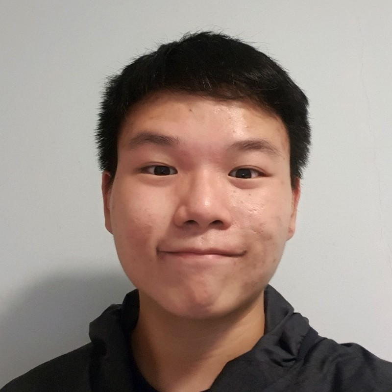
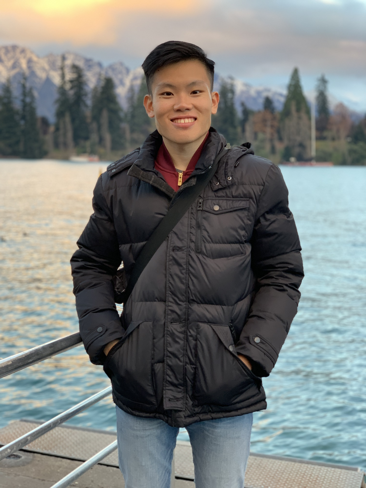
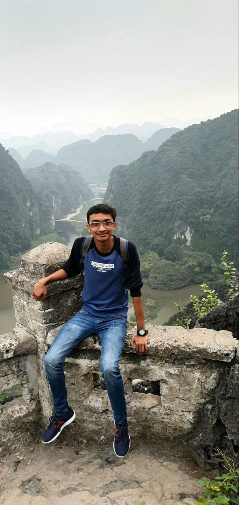
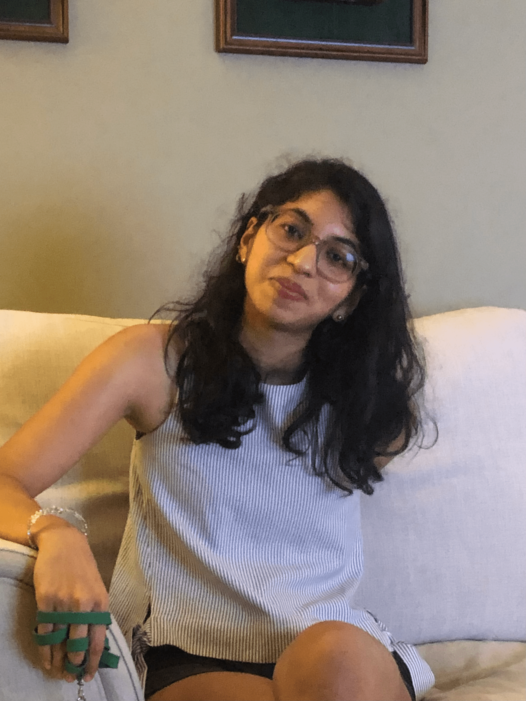

We are a team based in the [School of Computing, National University of Singapore](http://www.comp.nus.edu.sg).

## Project team

### Lim Bing Sen

[[github](https://github.com/bingsen0806)]
[[portfolio](team/bingsen0806.md)]

* Role: Developer, Project Lead
* Responsibilities: Book commands

### Ang Yong Liang

[[github](http://github.com/yl-ang)]
[[portfolio](team/yl-ang.md)]

* Role: Developer
* Responsibilities: UI

### Tan Yu Qi

[[github](http://github.com/yuqitanyq)] [[portfolio](team/yuqitanyq.md)]

* Role: Developer
* Responsibilities: Implementation of General features and Integration

### Sarthak Pradhan

[[github](http://github.com/halpfrog)]
[[portfolio](team/halpfrog.md)]

* Role: Developer
* Responsibilities: General Commands

### Aditi Gupta

[[github](http://github.com/aditi2313)]
[[portfolio](team/aditi2313.md)]

* Role: Developer
* Responsibilities: Patron commands
