* Table of Contents
{:toc}

--------------------------------------------------------------------------------------------------------------------

## **Acknowledgements**

* This project is based on the AddressBook-Level3 project created by the [SE-EDU initiative](https://se-education.org).
* Libraries used: [JavaFX](https://openjfx.io/), [Jackson](https://github.com/FasterXML/jackson), [JUnit5](https://github.com/junit-team/junit5)

--------------------------------------------------------------------------------------------------------------------

## **Setting up, getting started**

Refer to the guide [_Setting up and getting started_](SettingUp.md).

--------------------------------------------------------------------------------------------------------------------

## **Design**

### Architecture

The ***Architecture Diagram*** given above explains the high-level design of the App.

Given below is a quick overview of main components and how they interact with each other.

**Main components of the architecture**

**`Main`** has two classes called [`Main`](https://github.com/AY2122S2-CS2103T-W14-1/tp/blob/master/src/main/java/seedu/address/Main.java) and [`MainApp`](https://github.com/AY2122S2-CS2103T-W14-1/tp/blob/master/src/main/java/seedu/address/MainApp.java). It is responsible for,
* At app launch: Initializes the components in the correct sequence, and connects them up with each other.
* At shut down: Shuts down the components and invokes cleanup methods where necessary.

[**`Commons`**](#common-classes) represents a collection of classes used by multiple other components.

The rest of the App consists of four components.

* [**`UI`**](#ui-component): The UI of the App.
* [**`Logic`**](#logic-component): The command executor.
* [**`Model`**](#model-component): Holds the data of the App in memory.
* [**`Storage`**](#storage-component): Reads data from, and writes data to, the hard disk.

Each of the four main components (also shown in the diagram above),

* defines its *API* in an `interface` with the same name as the Component.
* implements its functionality using a concrete `{Component Name}Manager` class (which follows the corresponding API `interface` mentioned in the previous point.

For example, the `Logic` component defines its API in the `Logic.java` interface and implements its functionality using the `LogicManager.java` class which follows the `Logic` interface. Other components interact with a given component through its interface rather than the concrete class (reason: to prevent outside component's being coupled to the implementation of a component), as illustrated in the (partial) class diagram below.

**How the architecture components interact with each other**

The *Sequence Diagram* below shows how the components interact with each other for the scenario where the user issues the command `patron delete 1`.

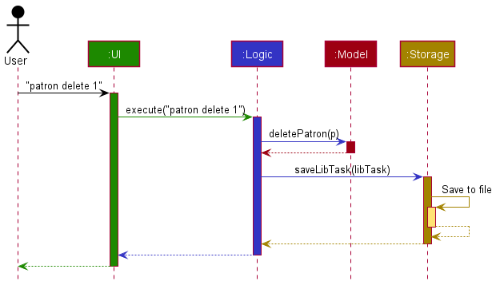

The sections below give more details of each component.

### UI component

The **API** of this component is specified in [`Ui.java`](https://github.com/AY2122S2-CS2103T-W14-1/tp/blob/master/src/main/java/seedu/address/ui/Ui.java)

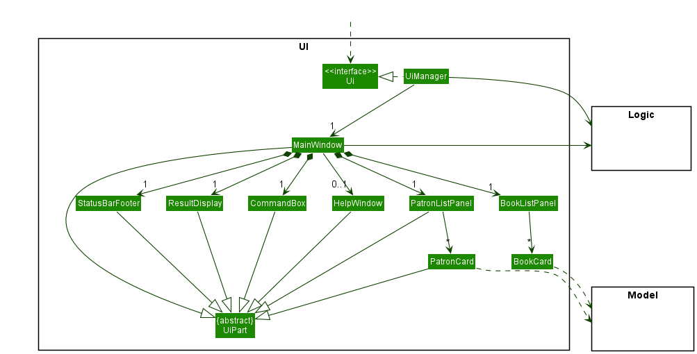

The UI consists of a `MainWindow` that is made up of parts e.g.`CommandBox`, `ResultDisplay`, `PatronListPanel`, `BookListPanel`, `StatusBarFooter` etc. All these, including the `MainWindow`, inherit from the abstract `UiPart` class which captures the commonalities between classes that represent parts of the visible [GUI](#glossary).

The `UI` component uses the JavaFx UI framework. The layout of these UI parts are defined in matching `.fxml` files that are in the `src/main/resources/view` folder. For example, the layout of the [`MainWindow`](https://github.com/AY2122S2-CS2103T-W14-1/tp/blob/master/src/main/java/seedu/address/ui/MainWindow.java) is specified in [`MainWindow.fxml`](https://github.com/AY2122S2-CS2103T-W14-1/tp/blob/master/src/main/resources/view/MainWindow.fxml)

The `UI` component,

* executes user commands using the `Logic` component.
* listens for changes to `Model` data so that the UI can be updated with the modified data.
* keeps a reference to the `Logic` component, because the `UI` relies on the `Logic` to execute commands.
* depends on some classes in the `Model` component, as it displays `Patron` and `Book` objects residing in the `Model`.

### Logic component

**API** : [`Logic.java`](https://github.com/AY2122S2-CS2103T-W14-1/tp/blob/master/src/main/java/seedu/address/logic/Logic.java)

Here's a (partial) class diagram of the `Logic` component:

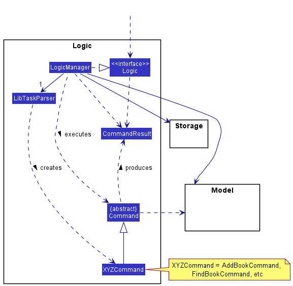

How the `Logic` component works:
1. When `Logic` is called upon to execute a command, it uses the `LibTaskParser` class to parse the user command.
2. This results in a `Command` object (more precisely, an object of one of its subclasses e.g., `AddPatronCommand` or `AddBookCommand`) which is executed by the `LogicManager`.
3. The command can communicate with the `Model` when it is executed (e.g. to add a Patron or a Book).
4. The result of the command execution is encapsulated as a `CommandResult` object which is passed back to the `Ui`, which is then used by the `Ui` to perform certain actions, such as displaying the results to the user.

The Sequence Diagram below illustrates the interactions within the `Logic` component for the `execute("patron delete 1")` API call.

:information_source: **Note:** The lifeline for `BookCommandParser` and `DeleteBookCommandParser` should end at the destroy marker (X) but due to a limitation of PlantUML, the lifeline reaches the end of diagram.

Here are the other classes in `Logic` (omitted from the class diagram above) that are used for parsing a user command:

How the parsing works:
* When called upon to parse a user command, the `LibTaskParser` class creates a `PatronCommandParser` if the command starts with `patron`, a `BookCommandParser` if the command starts with `book`, and a `XYZCommandParser` otherwise.
* If `PatronCommandParser` or `BookCommandParser` is created, it will further create a `XYZCommandParser` (`XYZ` is a [placeholder](#glossary) for the specific command name e.g., `AddPatronCommandParser` or `AddBookCommandParser`) which uses the other classes shown above to parse the user command and create a `XYZCommand` object (e.g., `AddPatronCommand` or `AddBookCommand`) which the `LibTaskParser` returns back as a `Command` object.
* All `XYZCommandParser` classes (e.g., `AddPatronCommandParser`, `AddBookCommandParser`, ...) implement the `Parser` interface so that they can be treated similarly where possible e.g, during testing.

### Model component
**API** : [`Model.java`](https://github.com/AY2122S2-CS2103T-W14-1/tp/blob/master/src/main/java/seedu/address/model/Model.java)

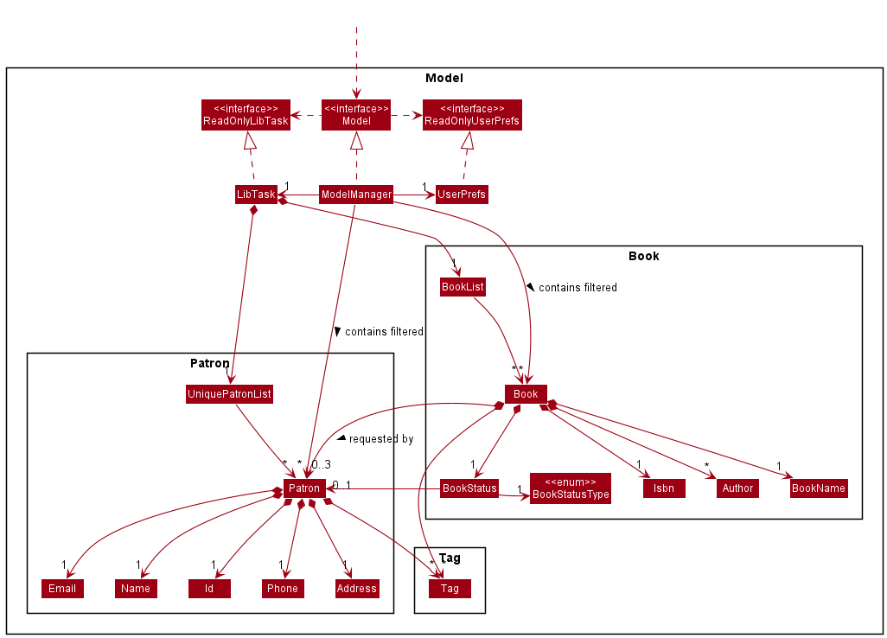

The `Model` component,

* stores the libtask data i.e., all `Patron` objects (which are contained in a `UniquePatronList` object) and `Book` objects (which are contained in a `BookList` object).
* stores the currently 'selected' `Patron` and `Book` objects (e.g., results of a search [query](#glossary)) as a separate _filtered_ list which is exposed to outsiders as an unmodifiable `ObservableList<Patron>` abd `ObservableList<Book>` that can be 'observed' e.g. the UI can be bound to this list so that the UI automatically updates when the data in the list change.
* stores a `UserPref` object that represents the user’s preferences. This is exposed to the outside as a `ReadOnlyUserPref` objects.
* does not depend on any of the other three components (as the `Model` represents data entities of the domain, they should make sense on their own without depending on other components)

:information_source: **Note:** An alternative (arguably, a more [OOP](#glossary)) model is given below. It has a `Tag` list in the `LibTask`, which `Patron` references. This allows `LibTask` to only require one `Tag` object per unique tag, instead of each `Patron` needing their own `Tag` objects. 

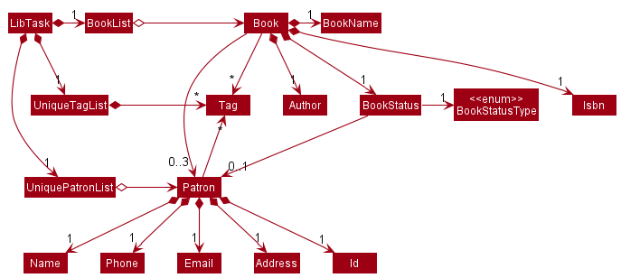

### Storage component

**API** : [`Storage.java`](https://github.com/AY2122S2-CS2103T-W14-1/tp/blob/master/src/main/java/seedu/address/storage/Storage.java)

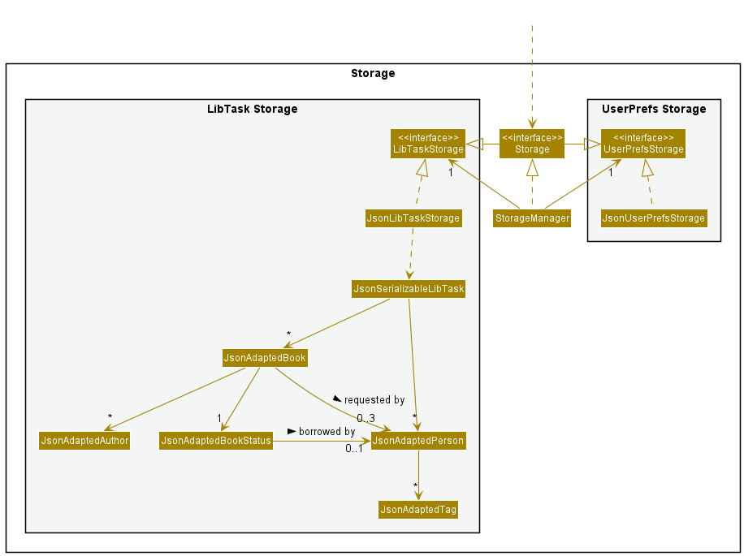

The `Storage` component,
* can save both libTask data and user preference data in [json](#glossary) format, and read them back into corresponding objects.
* implements both `LibTaskStorage` and `UserPrefStorage`, which means it can be treated as either one (if only the functionality of only one is needed).
* depends on some classes in the `Model` component (because the `Storage` component's job is to save/retrieve objects that belong to the `Model`)

### Common classes

Classes used by multiple components are in the `seedu.addressbook.commons` package.

--------------------------------------------------------------------------------------------------------------------

## **Implementation**

This section describes some noteworthy details on how certain features are implemented.

### Model

The class diagram for the `Model` can be seen above in the [Design section](#model-component). Model contains two main object components, `Book` and `Patron`, with `Book` having a dependency on `Patron`. Such a design was chosen after a few iterations on other designs. The final design is documented here:

#### Implementation details

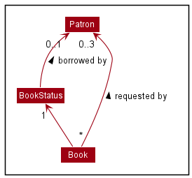

`Book` has a set of `Patron`s both have their own set of [attributes](#glossary), but only the most important ones are shown here. `Book` has a set of `Patron`s as `requesters`. It also has a `BookStatus` containing an optional `Patron` representing the borrower of the book.

#### Design considerations

Initially, `Patron` and `Book` were designed in a way such that both classes contain references to each other. This design allows fast and direct access of certain information, such as all books borrowed and requested by a patron. However, the initial design results in [cyclic reference](#glossary) among classes, which makes it impossible to store patron and book information in json format. For example, the patron json object needs to store a list of books it is referencing, which in turns store a list of patrons it is referencing, which in turn stores more patrons.

Furthermore, the initial design results in the problem of cyclic update whenever data is modified. For example, when a patron's name is changed, the corresponding borrower's name of all books borrowed by that patron needs to be changed as well. Since `Book` is [immutable](#glossary), new `Book` objects are created to update the information, and as a result, all `Patron` objects referencing those old `Book` objects needs to be updated as well. Since `Patron` is also immutable, the chain of never ending cyclic updates continues on.

Due to the downsides of the initial design, a decision was made to have only one of `Book` or `Patron` depending on the other. `Book` was chosen to depend on `Patron` because the UI needs to display information of borrower and requesters together with the book. This design does not require the transversal of the whole `UniquePatronList` to identify the borrower and requesters of the book, since such information is stored in `Book` itself. However, transversal of the whole `BookList` is required to find all books related to a patron, or when updating a patron's information. Nevertheless, the amortized cost is much lower as such commands are performed less frequently than the amount of UI updates.

### Saving books and patrons to Json format

The saving of books and patrons to json format is performed by the `Storage` component, which class diagram can be seen [above](#storage-component).The `JsonSerializableLibTask` stores both `JsonAdaptedPatron` and `JsonAdaptedBook`, which implementations will be discussed below.

#### Implementation details
`JsonAdaptedBook` is an object that represents a `Book` object in its json format. It is responsible for converting attributes in `Book` to json compatible formats. `JsonApdatedBook` contains a `JsonAdaptedBookStatus` , and may contain multiple instances of `JsonAdaptedPatron`, `JsonAdaptedAuthor`, and `JsonAdaptedTag` as requesters, authors, and tags respectively

`JsonAdaptedPatron` is an object that represents a `Patron` object in its json format. It is responsible for converting attributes in `Patron` to its json compatible formats. It may contain multiple instances of `JsonAdaptedTag`

Attributes of `Book` and `Patron` not mentioned above are stored directly as a String in `JsonAdaptedBook` and `JsonAdaptedPatron` respectively. For example, the [isbn](#glossary) of a book is stored as a String and not converted to a class named `JsonAdaptedIsbn` before saving.

#### Design considerations

Aspect: How to store a list of patrons requesting for a book.

* Alternative 1 (current choice): `JsonAdaptedBook` stores a list of `JsonAdaptedPatron`
  * Pros: Fast program loading time as requester `Patron` objects can be created directly with all the provided information, without the need to search through `UniquePatronList` for a `Patron` with matching name.
  * Cons: Overhead in converting `Patron` object to `JsonAdaptedPatron` and more storage space used.
* Alternative 2: `JsonAdaptedBook` stores a list of String representing the name of the patrons. This is possible since patrons can be identified by their unique names.
  * Pros: Less overhead in converting `Patron` object to `JsonAdaptedPatron` and less storage space used.
  * Cons: Slow program loading time. When the program loads up, for every name we need to search through the whole `UniquePatronList` for the specified `Patron` object before we can initialize a `Book` object that refers to the `Patron` as requester. Furthermore, this design is not flexible to changes if we need to patron names are no longer unique.

### Borrow Feature

This feature allows users to keep track of books that are borrowed and the patrons who borrowed them, as well as its return date.

#### Implementation details

The borrow feature is facilitated by `BorrowCommandParser` and `BorrowCommand`. The operation is exposed in the Model interface as `Model#borrowBook()`.

Given below is an example usage scenario and how the borrow mechanism behaves at each step:

1. The user enters the borrow command and provides the index of book to be borrowed, index of borrower patron, and the return date.
2. `LibTaskParser` creates a new `BorrowCommandParser` after preliminary processing of user input.
3. `BorrowCommandParser` creates a new `BorrowCommand` based on the processed input.
4. `LogicManager` executes the `BorrowCommand`.
5. `BorrowCommand` calls `Model#getFilteredPatronList()` to get the list of displayed patrons, and then gets the borrower at the specified index.
6. `BorrowCommand` calls `Model#getFilteredBookList()` to get the list of displayed books, and then get the book to be borrowed at the specified index.
7. `BorrowCommand` calls `Model#borrowBook()` and passes the borrower, book to be borrowed and return date as [parameters](#glossary).
8. Finally, `BorrowCommand` creates a `CommandResult` and returns it to `LogicManager` to complete the command.

The following sequence diagram shows how the borrow command works:

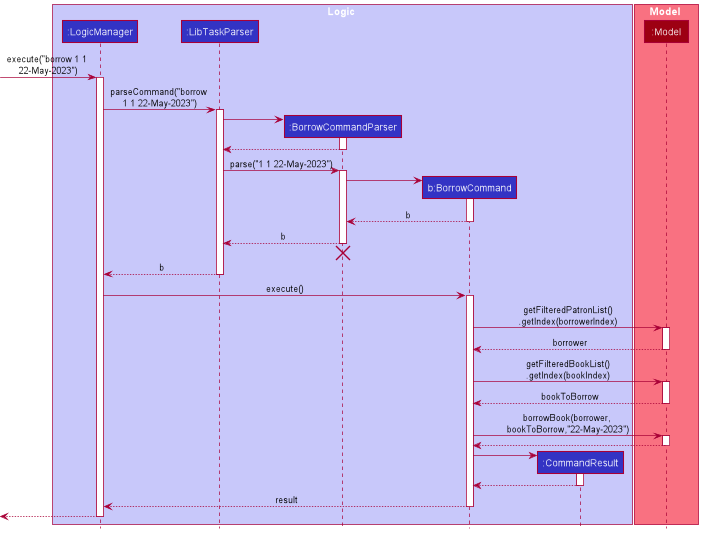

:information_source: **Note:** The lifeline for `BorrowCommandParser` should end at the destroy marker (X) but due to a limitation of PlantUML, the lifeline reaches the end of diagram.

The following [activity diagram](#glossary) summarizes what happens when a user executes a borrow command:

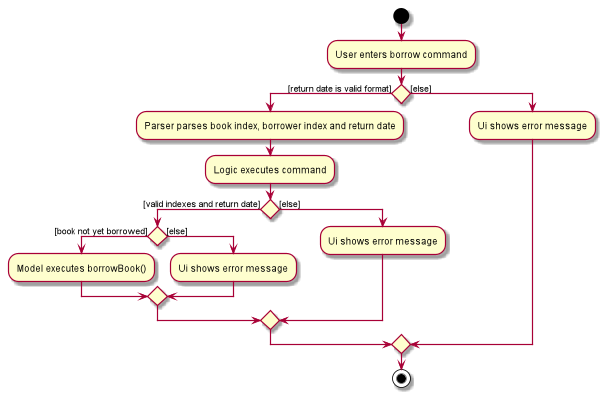

#### Design considerations

The borrow command is designed to be used in conjunction with the `book find` and `patron find` command. For instance, the user would first use `patron find n/Alex Yeoh` and `book find n/Harry Potter` to find the borrower and book to be borrowed, before entering `borrow 1 1 23-May-2022` to keep track of Alex Yeoh borrowing Harry Potter until 23-May-2022.

This integration of borrow command with the find commands is important because LibTask can store large amounts of books and patrons, making it infeasible for the user to scroll through both patron list and book list to identify the target patron and book. By designing borrow command to work based on indexes, we do not restrict users to borrow books based on a fixed attribute, for example, book isbn and patron id. This allows users to search for books and patrons in any way they deem convenient (e.g. using tags, names etc.), thus enhancing the usability of borrow feature.

### Return Feature

This feature allows users to return a borrowed book, or all books that were borrowed by a patron.

#### Implementation details

The borrow feature is facilitated by `ReturnCommandParser`, `ReturnOneBookCommand`, and `ReturnAllBooksCommand`. `ReturnOneBookCommand` is the concrete `Command` class responsible for returning a single book, while `ReturnAllBooksCommand` is the concrete `Command` class responsible fo returning all books borrowed by a patron. The functionality of returning all books by a patron is exposed in Model interface as `Model#returnAllBorrowedBooks()`, while the functionality to return a single book is facilitated by `Model#setBook()`.

Due to the high similarities in both return commands, only the implementation of `ReturnAllBooksCommand` will be discussed below.

Given below is an example usage scenario and how the return mechanism behaves at each step:

1. The user enters the return command and provides the index of patron whose books should be returned.
2. `LibTaskParser` creates a new `ReturnCommandParser` after preliminary processing of user input.
3. `ReturnCommandParser` creates a new `ReturnAllBooksCommand` based on the processed input.
4. `LogicManager` executes the `ReturnAllBooksCommand`.
5. `ReturnAllBooksCommand` calls `Model#getFilteredPatronList()` to get the list of displayed patrons, and then gets the borrower at the specified index.
6. `ReturnAllBooksCommand` calls `Model#returnAllBorrowedBooks()` and passes the borrower as parameter.
7. `ReturnAllBooksCommand` calls `Model#deleteAllRequests()` to delete all book requests for the returned books, and gets a message that reminds the user to notify patrons who requested for those books.
8. Finally, `ReturnAllBooksCommand` creates a `CommandResult` with the message and returns it to `LogicManager` to complete the command.

The following sequence diagram shows how the return command works:

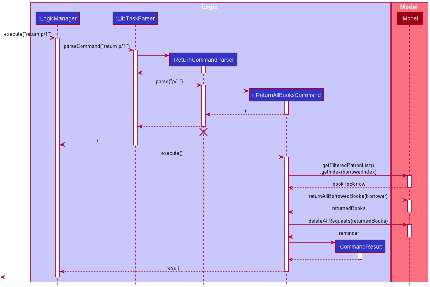

:information_source: **Note:** The lifeline for `ReturnCommandParser` should end at the destroy marker (X) but due to a limitation of PlantUML, the lifeline reaches the end of diagram.

The following activity diagram summarizes what happens when a user executes a return command:

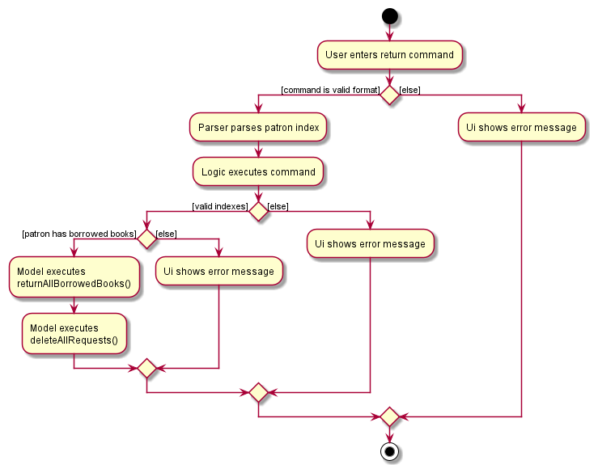

#### Design considerations

The return command is designed to be to return multiple books in one command, while providing the user with the option of returning a single book. This enhances the usability of the feature, as the librarian can experience more efficient processing of books, while retaining fine-grain control of the process if needed (e.g. in situations when a patron only intends to return some of his/her borrowed books).

Despite having similar functionalities, the return commands are split into `ReturnOneBookCommand` and `ReturnAllBooksCommand` because they depend on different methods in `Model`, and have structurally similar but logically different execution. As per the [_Single Responsibility Principle_](#glossary), the return commands are separated into different classes so that each class is responsible for the logical implementation of only one subcommand.

### Overdue Patron List Feature

This feature allows users to view a list of patrons with overdue books.

#### Implementation details

The overdue patron feature is facilitated by `PatronCommandParser` and `OverduePatronCommand`. `OverduePatronCommand` is the concrete `Command` class responsible for returning a filtered list of patrons with overdue books from LibTask's main patron list. The class does this by checking if each patron has overdue books, a functionality exposed in the Model interface as `Model#hasOverdueBooks()`.

Given below is an example usage scenario and how the overdue mechanism behaves at each step:

1. The user enters the overdue command.
2. `LibTaskParser` creates a new `PatronCommandParser` after preliminary processing the first argument of user input as `patron`.
3. `PatronCommandParser` creates a new `OverduePatronCommand` after processing the second argument of user input as `overdue`.
4. `LogicManager` executes the `OverduePatronCommand`.
5. `OverduePatronCommand` calls `Model#updateFilteredPatronList()` to get a filtered list of patrons with overdue books by passing in `Model#hasOverdueBooks()` as predicate argument.
6. Finally, `OverduePatronCommand` creates a `CommandResult` with the message and returns it to `LogicManager` to complete the command.

The following sequence diagram shows how the overdue command works:

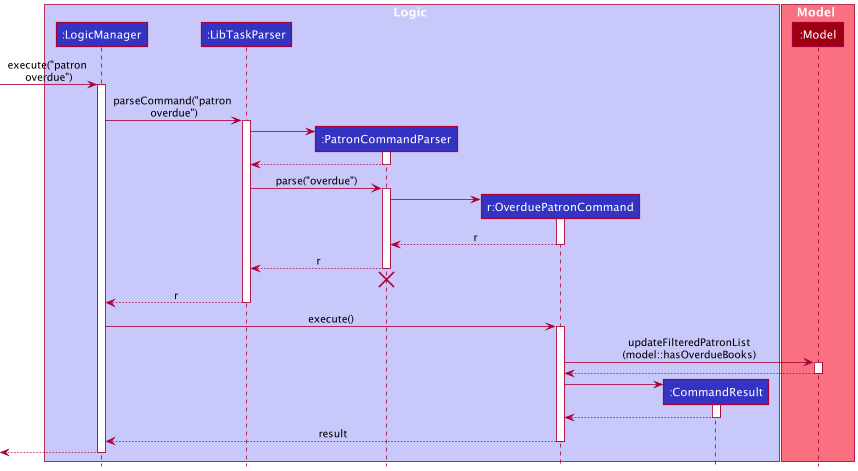

:information_source: **Note:** The lifeline for `PatronCommandParser` should end at the destroy marker (X) but due to a limitation of PlantUML, the lifeline reaches the end of diagram.

The following activity diagram summarizes what happens when a user executes an overdue command:

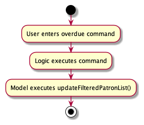

#### Design considerations

Unlike some other patron and book features, `patron overdue` designed to be a stand-alone command (i.e. does not need to be used in conjunction with any other command) and requires no parameters. This is because iterating through LibTask patrons and filtering them based on their borrowed book statuses does not require pre-processing by any other command or additional information.

LibTask can store a large number of books and patrons, making it infeasible for the user to scroll through the book list to identify patrons with books borrowed beyond their return dates. The design of the overdue command hence enhances LibTask's usability, as librarians can experience more efficient processing of overdue books.

`patron overdue` is designed to not affect the displayed book list while interacting with LibTask's patron list (for example by displaying all overdue books in the displayed book list). However, executing the `book related` command in succession to the overdue command gives users a more detailed view the patron's overdue books.

### Request Feature

This feature allows users to keep track of books that are requested by patrons, and allow users to be automatically reminded to notify requesters when the books of interest become available.

#### Implementation details

The request feature is facilitated by `BookCommandParser`, `RequestBookCommandParser`, and `RequestBookCommand`. The operation is exposed in the Model interface as `Model#addRequest()`.

Given below is an example usage scenario and how the request mechanism behaves at each step:

1. The user enters the request command and provides the index of the requester patron, and the index of book to be requested.
2. `LibTaskParser` creates a new `BookCommandParser` after preliminary processing of user input, which in turns creates a new `RequestBookCommandParser`.
3. `RequestBookCommandParser` creates a new `RequestBookCommand` based on the processed input.
4. `LogicManager` executes the `RequestBookCommand`.
5. `RequestBookCommand` calls `Model#getFilteredPatronList()` to get the list of displayed patrons, and then gets the requester at the specified index. It then calls `Model#getFilteredBookList()` to get the list of displayed books, and then get the book to be requested at the specified index.
6. `RequestBookCommand` calls `Model#isBorrowing()` to check that the requester is not currently borrowing a copy of the requested book, to prevent a patron from requesting a book he/she is already borrowing.
7. `RequestBookCommand` calls `Model#hasAvailableCopy()` to confirm that there are no available copies of the requested book. This is because there is no need for a book request if there is an available copy of the book.
8. `RequestBookCommand` calls `Model#addRequest()` to add the book request to all book copies with the same isbn as the requested book.
9. Finally, `RequestBookCommand` creates a `CommandResult` and returns it to `LogicManager` to complete the command.

The following sequence diagram shows how the request command works:

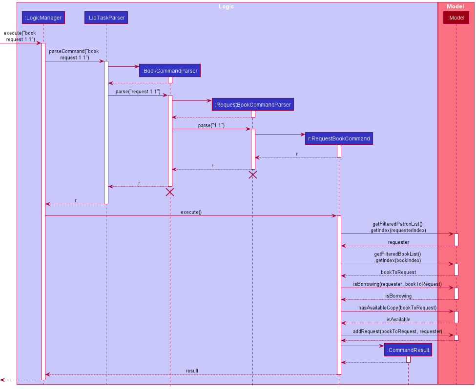

:information_source: **Note:** The lifeline for `BookCommandParser` and `RequestBookCommandParser` should end at the destroy marker (X) but due to a limitation of PlantUML, the lifeline reaches the end of diagram.

The following activity diagram summarizes what happens when a user executes a request command:

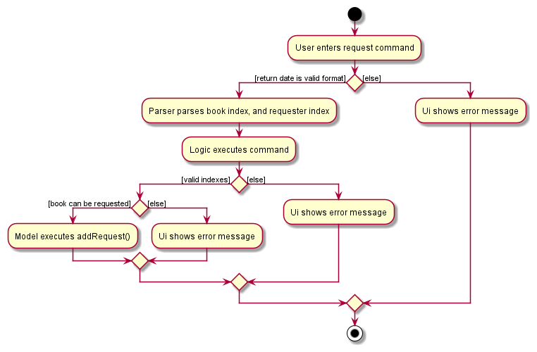

#### Design considerations

Each book request is designed to bind to an isbn instead of a book copy. For example, when a patron requests to be notified when the first book becomes available, LibTask attaches the book request to all books with the same isbn as the first book. This is in-line with our use case, as it is rational to assume that patrons are not particular about which book copy they are requesting for.

Associating a book request with multiple book copies introduces some problems. Initially, when a book becomes available, the same reminder message to the user will be printed multiple times, once per book request per book copy. Nevertheless, this is solved by using a `Set` to store reminder messages so that identical reminder messages will not be added multiple times.

### Book Related Feature

This feature allows users to list and view all the books borrowed or requested by a patron.

#### Implementation details

The related feature is facilitated by `BookCommandParser`, `RelatedBookCommandParser`, and `RelatedBookCommand`.

Given below is an example usage scenario and how the related mechanism behaves at each step:

1. The user enters the related command and provides the index of the patron to relate to.
2. `LibTaskParser` creates a new `BookCommandParser` after preliminary processing of user input, which in turn creates a new `RelatedBookCommandParser`.
3. `RelatedBookCommandParser` creates a new `RelatedBookCommand` based on the processed input.
4. `RelatedBookCommand` object would be returned to `LogicManager`.
5. `LogicManager` then executes the `RelatedBookCommand` object.
6. `RelatedBookCommand` calls `Model#getFilteredPatronList()` to get the list of displayed patrons, and then gets the patron at that specified index.
7. `RelatedBookCommand` then creates a `BookRelatedToPatronPredicate` object named `predicate` with the patron.
8. `RelatedBookCommand` calls `Model#updateFilteredBookList()` with the `predicate`, resulting in the book list to be updated to display all the books borrowed and requested by the patron.
9. Finally, `RelatedBookCommand` creates a `CommandResult` and returns it to `LogicManager` to complete the command.

The following sequence diagram shows how the related command works:

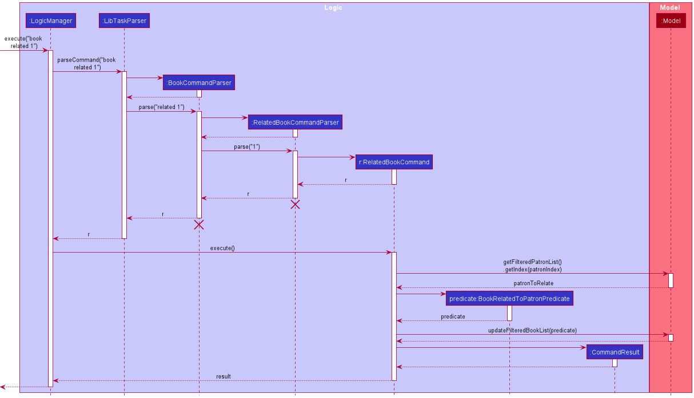

:information_source: **Note:** The lifeline for `BookCommandParser` and `RelatedBookCommandParser` should end at the destroy marker (X) but due to a limitation of PlantUML, the lifeline reaches the end of diagram.

The following activity diagram summarizes what happens when a user executes a related command:

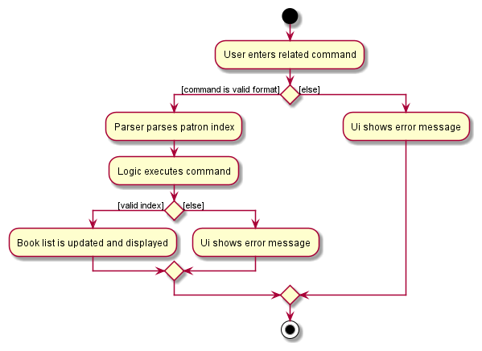

#### Design considerations

LibTask can store a large number of books and patrons, making it infeasible for the user to scroll through the book list to identify the books borrowed or requested by a patron. The design of the related command hence enhances LibTask's usability, as librarians can be more efficient in identifying the books related to the patron.

### Book Find feature

This feature allows users to search for any books with either the tag, title or author's name. 

#### Implementation
The Book find feature is facilitated by the `BookCommandParser`, `FindBookParser` and `FindBookCommand`. 

Given below is an example usage scenario and how the request mechanism behaves at each step:

1. The user enters a book find command and provides the parameter for the search query.
2. `LibTaskParser` creates a new `BookCommandParser` after preliminary processing of user input, which in turns creates a new `FindBookParser`.
3. `FindBookParser` creates either a `BookAuthorContainsKeywordsPredicate` or `BookNameContainsKeywordsPredicate` or `BookTagContainsKeywordsPredicate` object `predicate` with the search query.
4. `FindBookParser` creates a new `FindBookCommand` based on the processed input and passes the `predicate` on.
5. `LogicManager` then executes the `FindBookCommand`. 
6. `FindBookCommand` calls `Model#updateFilteredBookList()` with the `predicate`, resulting in the book list to be updated to display all the books that match the given search query.
7. Finally, the `FindBookCommand` creates a `CommandResult` and returns it to `LogicManager` to complete the command. 

The following sequence diagram shows how the request command works:

:information_source: **Note:** The lifeline for `BookCommandParser` and `FindBookCommandParser` should end at the destroy marker (X) but due to a limitation of PlantUML, the lifeline reaches the end of diagram.

The following activity diagram summarizes what happens when a user executes a request command:

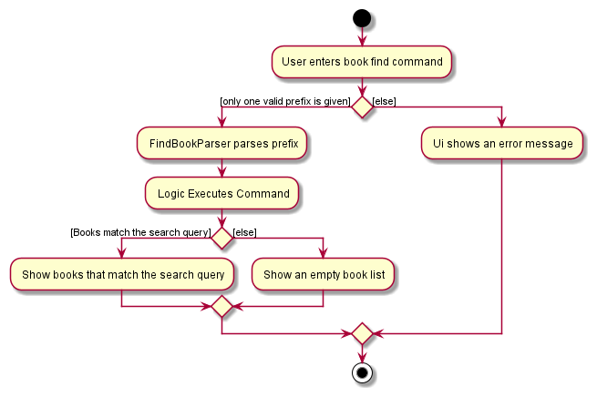

#### Design considerations

Each find query can only be one of either the tag, author or title. The feature is designed to display all books that match the predicate created and display them. We chose not to include the isbn as a user searchable query as it is likely that most users would remember the title of the book or the author's name rather than the isbn.
To account for cases where there might be multiple editions of the same book, the book find will return partial matches. This increases usability as the librarian can find all books that match the title even if it is the first edition or the fifth.
The feature is also designed to make other features like `borrow` and `request` easier. LibTask can store a large amount of books and users cannot be expected to scroll through them just to find the index of the book they are looking for. `book find` aims to reduce the time spent searching by providing a simple way to search for your book in multiple ways.

### \[Proposed\] Undo/redo feature

#### Proposed Implementation

The proposed undo/redo mechanism is facilitated by `VersionedLibTask`. It extends `LibTask` with an undo/redo history, stored internally as an `libTaskStateList` and `currentStatePointer`. Additionally, it implements the following operations:

* `VersionedLibTask#commit()` —  Saves the current LibTask state in its history.
* `VersionedLibTask#undo()` —  Restores the previous LibTask state from its history.
* `VersionedLibTask#redo()` —  Restores a previously undone LibTask state from its history.

These operations are exposed in the `Model` interface as `Model#commitLibTask()`, `Model#undoLibTask()` and `Model#redoLibTask()` respectively.

Given below is an example usage scenario and how the undo/redo mechanism behaves at each step.

Step 1. The user launches the application for the first time. The `VersionedLibTask` will be initialized with the initial LibTask state, and the `currentStatePointer` pointing to that single LibTask state.

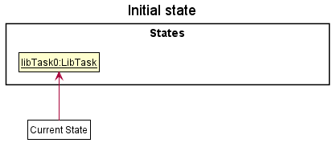

Step 2. The user executes `patron delete 5` command to delete the 5th patron in the LibTask. The `patron delete` command calls `Model#commitLibTask()`, causing the modified state of the LibTask after the `patron delete 5` command executes to be saved in the `libTaskStateList`, and the `currentStatePointer` is shifted to the newly inserted LibTask state.

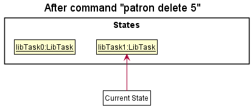

Step 3. The user executes `patron add n/David …​` to add a new patron. The `patron add` command also calls `Model#commitLibTask()`, causing another modified LibTask state to be saved into the `libTaskStateList`.

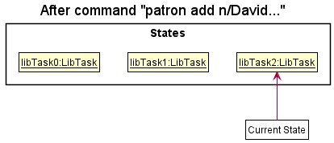

:information_source: **Note:** If a command fails its execution, it will not call `Model#commitLibTask()`, so the LibTask state will not be saved into the `libTaskStateList`.

Step 4. The user now decides that adding the patron was a mistake, and decides to undo that action by executing the `undo` command. The `undo` command will call `Model#undoLibTask()`, which will shift the `currentStatePointer` once to the left, pointing it to the previous LibTask state, and restores the LibTask to that state.

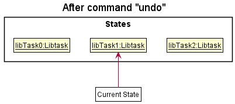

:information_source: **Note:** If the `currentStatePointer` is at index 0, pointing to the initial LibTask state, then there are no previous LibTask states to restore. The `undo` command uses `Model#canUndoLibTask()` to check if this is the case. If so, it will return an error to the user rather than attempting to perform the undo.

The following sequence diagram shows how the undo operation works:

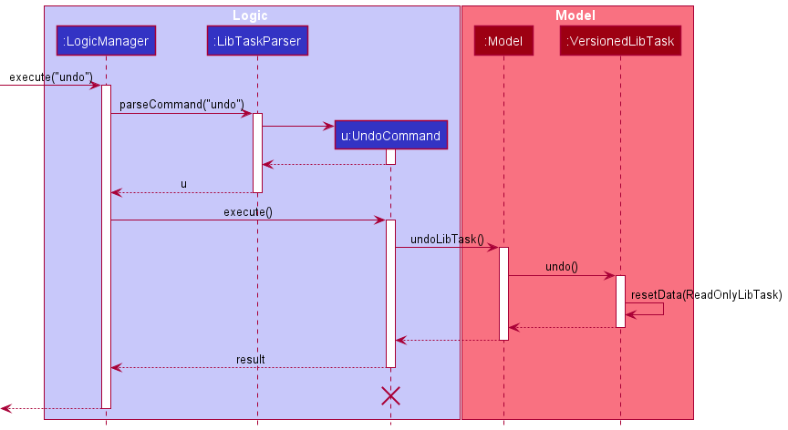

:information_source: **Note:** The lifeline for `UndoCommand` should end at the destroy marker (X) but due to a limitation of PlantUML, the lifeline reaches the end of diagram.

The `redo` command does the opposite — it calls `Model#redoLibTask()`, which shifts the `currentStatePointer` once to the right, pointing to the previously undone state, and restores the LibTask to that state.

:information_source: **Note:** If the `currentStatePointer` is at index `libTaskStateList.size() - 1`, pointing to the latest LibTask state, then there are no undone LibTask states to restore. The `redo` command uses `Model#canRedoLibTask()` to check if this is the case. If so, it will return an error to the user rather than attempting to perform the redo.

Step 5. The user then decides to execute the command `list`. Commands that do not modify the LibTask, such as `list`, will usually not call `Model#commitLibTask()`, `Model#undoLibTask()` or `Model#redoLibTask()`. Thus, the `libTaskStateList` remains unchanged.

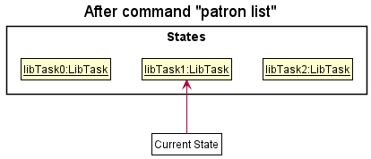

Step 6. The user executes `clear`, which calls `Model#commitLibTask()`. Since the `currentStatePointer` is not pointing at the end of the `libTaskStateList`, all LibTask states after the `currentStatePointer` will be purged. Reason: It no longer makes sense to redo the `add n/David …​` command. This is the behavior that most modern desktop applications follow.

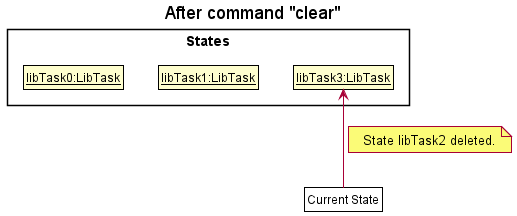

The following activity diagram summarizes what happens when a user executes a new command:

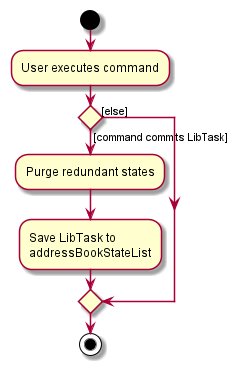

#### Design considerations:

**Aspect: How undo & redo executes:**

* **Alternative 1 (current choice):** Saves the entire LibTask.
    * Pros: Easy to implement.
    * Cons: May have performance issues in terms of memory usage.

* **Alternative 2:** Individual command knows how to undo/redo by
  itself.
    * Pros: Will use less memory (e.g. for `delete`, just save the person being deleted).
    * Cons: We must ensure that the implementation of each individual command are correct.

--------------------------------------------------------------------------------------------------------------------

## **Documentation, logging, testing, configuration, dev-ops**

* [Documentation guide](Documentation.md)
* [Testing guide](Testing.md)
* [Logging guide](Logging.md)
* [Configuration guide](Configuration.md)
* [DevOps guide](DevOps.md)

--------------------------------------------------------------------------------------------------------------------

## **Appendix: Requirements**

### Product scope

LibTask aids librarians in managing statuses of books borrowed and along with their borrowers. Keeping track of book requests by patrons who are interested in the books when they become available. Organizing books and patrons into categories for effective querying and extraction of insightful data.

**Target user profile**:

* a librarian who wants to manage book loans and requests by patrons
* prefer desktop apps over other types of applications
* can type fast
* prefers typing to mouse interactions
* is reasonably comfortable using [CLI](#glossary) applications

**Value proposition**: simplifying how librarians manage library book loans and requests by patrons.

### User stories

Priorities: High (must have) - `* * *`, Medium (nice to have) - `* *`, Low (unlikely to have) - `*`

| Priority | As a …​                      | I want to …​                                          | So that …​                                                                             |
|----------|------------------------------|-------------------------------------------------------|----------------------------------------------------------------------------------------|
| `***`    | Librarian                    | add a patron                                          | I can keep track of books borrowed or requested by the patron                          |
| `***`    | Librarian                    | delete a patron                                       | I do not get overwhelmed by data of graduated students or retired staff                |
| `***`    | librarian                    | list all patrons                                      | I can see all the existing patrons                                                     |
| `***`    | Librarian                    | add a book                                            | I can keep track of details of the book                                                |
| `***`    | Easily overwhelmed librarian | delete a book                                         | I do not get overwhelmed by information about books that no longer exist               |
| `***`    | Librarian                    | list all books                                        | I can see all the existing books                                                       |
| `***`    | Librarian                    | be able to view patron and book details through a GUI | I can easily recognize the existing patrons and books details                          |
| `**`     | librarian                    | edit information about a patron                       | I have their latest contact when I need to contact them                                |
| `**`     | Efficient librarian          | find patrons based on their names                     | I do not get overwhelmed by long lists of patrons in uncategorized search results      |
| `**`     | Efficient librarian          | view patrons with overdue books                       | I can contact them to return the overdue books                                         |
| `**`     | Careless librarian           | edit information about a book                         | I can correct typos in the details of the books when I first added them                |
| `**`     | Request handler              | filter books based on authors, titles and tags        | I can quickly navigate the book when a patron is requesting it                         |
| `**`     | Librarian                    | classify books into categories                        | I can more easily provide book recommendations                                         |
| `**`     | Librarian                    | store details about a book loan by a patron           | I can perform tasks such as sorting, searching or categorizing books and patrons later |
| `**`     | Request handler              | take note of book requests from students              | I can easily notify the student when the book under request is returned                |
| `**`     | Librarian                    | find all the books related to a patron                | I can see all books related to a patron at one glance                                  |
| `**`     | Librarian                    | update return and request status of books             | I can keep track of a book’s availability                                              |
| `**`     | Efficient librarian          | refer to previous commands                            | I can save time from retyping past commands                                            |
| `*`      | Efficient librarian          | filter patrons in my database based on books          | I can know which patrons are requesting or borrowing the book                          |

### Use cases

(For all use cases below, the **System** is the `LibTask` and the **Actor** is the `user`, unless specified otherwise)

**UC01: Adding a patron to LibTask**

**MSS**

1. User requests to add a patron and provides the name and details of the patron.

2. LibTask adds the patron.

   Use case ends.

**Extensions**

* 1a. Compulsory fields are not provided.

    * 1a1. LibTask shows an error message.

  Use case resumes from step 1.

* 1b. The patron details are invalid.

    * 1b1. LibTask shows an error message.

  Use case resumes from step 1.

* 1c. The given name and details except phone number are duplicated.

    * 1c1. LibTask shows an error message.

  Use case resume from step 1.

--------------------------------------------------------------------------------------------------------------------

**UC02: List patron's on LibTask**

**MSS**

1. User requests to list all patrons.

2. LibTask shows the list of all the patrons.

   Use case ends.

**Extensions**

* 2a. LibTask has no stored patrons.

    * 2a1. LibTask shows an empty patron list.

  Use case ends.

--------------------------------------------------------------------------------------------------------------------

**UC03: Editing a patron on LibTask**

**MSS**
1. User list all patrons [UC02](#uc02-list-patrons-on-libtask)

2. User requests to edit a patron and provide the index and the necessary details to be edited.

3. LibTask edits the patron.

   Use case ends.

**Extensions**

* 1a. The index is not provided or is invalid.

    * 1a1. LibTask shows an error message.

  Use case resumes from step 1.

* 1b. The details are not provided or are invalid.

    * 1b1.  LibTask shows an error message.

  Use case resume from step 1.

* 1c. The index is valid but no details are provided.

  * 1c1. LibTask shows an error message.

  Use case resumes from step 1.

--------------------------------------------------------------------------------------------------------------------

**UC04: Find a patron on LibTask**

**MSS**

1. User request to find patron(s) and provide a number of keywords.

2. LibTask shows the list of patrons that match the search.

   Use case ends.

**Extensions**

* 1a. Keywords not provided or are invalid.

    * 1a1. LibTask shows an error message.

  Use case resumes from step 1.

* 2a.  No patrons fulfil the search criteria.

    * 2a1. LibTask shows an empty list.

  Use case ends.

--------------------------------------------------------------------------------------------------------------------

**UC05: Delete a patron from LibTask**

**MSS**

1. User list all patrons [UC02](#uc02-list-patrons-on-libtask).

2. User requests to delete a patron and provide the index.

3. LibTask deletes the patron.

   Use case ends.

**Extensions**

* 2a. The index is not provided or is invalid.

    * 2a1. LibTask shows an error message.

  Use case resumes from step 1.

* 2b. The patron has a book borrowed.

    * 2b1. LibTask shows an error message.

  Use case resumes from step 1.

* 2c. The patron has a book requested.

    * 2c1. LibTask deletes the patron from the list of requesters

  Use case resumes from step 3.

--------------------------------------------------------------------------------------------------------------------

**UC06: Add book to LibTask**

**MSS**

1. User requests to add a book and provides the name and details of the book

2. LibTask adds the book.

   Use case ends.

**Extensions**

* 1a. Compulsory fields are not provided.

    * 1a1. LibTask shows an error message.

  Use case resumes from step 1.

* 1b. The book details are invalid.

    * 1b1. LibTask shows an error message.

  Use case resumes from step 1.

--------------------------------------------------------------------------------------------------------------------

**UC07: List Books on LibTask**

**MSS**
1. User requests to list all books.

2. LibTask shows the list of all the books.

   Use case ends.

**Extensions**

* 2a. LibTask has no stored books.

    * 2a1. LibTask shows an empty book list.

  Use case ends.

--------------------------------------------------------------------------------------------------------------------

**UC08: Edit a book on LibTask**

**MSS**

1. User requests to edit a book and provides the index of the book and the details.

2. LibTask edits the book.

   Use case ends.

**Extensions**

* 1a. The given index is invalid.

    * 1a1. LibTask shows an error message.

   Use case resumes from step 1.

* 1b. The new details are invalid.

    * 1b1. LibTask shows an error message.

   Use case resumes from step 1.

* 1c. The index is valid but no new details are entered.

    * 1c1. LibTask shows an error message saying that at least ISBN, author or category must be provided.

  Use case resumes from step 1.

--------------------------------------------------------------------------------------------------------------------

**UC09: Find books on LibTask**

**MSS**
1. User requests to find books and provides either a tag, author or title.

2. LibTask shows the books that match the search.

   Use case ends.

**Extension**

* 1a. The given search is invalid.

  * 1a1. LibTask shows an error message.

  Use case resumes from step 1.

* 1b. No books match the given query.

  * 1b1. LibTask shows an empty list.

  Use case ends.

* 1c. More than search parameter was provided.

  * 1c1. Lib Task shows an error message.

  Use case ends.

--------------------------------------------------------------------------------------------------------------------

**UC10: Delete Book from LibTask**

**MSS**

1. User requests to delete a book and provides the index.

2. LibTask deletes the book.

   Use case ends.

**Extensions**

* 1a. The given index is invalid.

    * 1a1. LibTask shows an error message.

   Use case resumes from step 1.

* 1b. The book is being borrowed.

  * 1b1. LibTask shows an error message.

   Use case resumes from step 1.

--------------------------------------------------------------------------------------------------------------------

**UC11: Borrow Book**

**MSS**

1. User lists all patrons. [UC02](#uc02-list-patrons-on-libtask)

2. User lists all books. [UC07](#uc07-list-books-on-libtask)

3. User requests to establish a borrow relationship and provides index of the patron and index of the book in lists, as well as return date of the book.

4. LibTask establishes a borrow relationship between the patron and the book.

   Use case ends.

**Extensions**

* 3a. The given index of patron or book is invalid.

    * 3a1. LibTask shows an error message.

  Use case resumes from step 3.

* 3b. The return date of the book is invalid.

    * 3a1. LibTask shows an error message.

  Use case resumes from step 3.

* 3c. The book is already borrowed.

    * 3c1. LibTask shows an error message.

  Use case resumes from step 3.

--------------------------------------------------------------------------------------------------------------------

**UC12: Return Book on LibTask**

**MSS**

1. User finds a patron. [UC04](#uc04-find-a-patron-on-libtask)

2. User requests to end a borrow relationship and provides index of the patron or index of the book in lists.

3. LibTask removes the borrow relationship between the patron and the book.

Use case ends.

**Extensions**

* 2a. The given index of patron or book is invalid.

    * 2a1. LibTask shows an error message.

  Use case resumes from step 2.

* 2b. The book is not borrowed by the patron.

    * 2a1. LibTask shows an error message.

  Use case resumes from step 2.

* 2c. The patron has not borrowed any books.

  * 2c1. LibTask shows an error message.

  Use case resumes from step 2

--------------------------------------------------------------------------------------------------------------------

**UC13: Show previously run commands**

**MSS**
1. User requests to see previous command.

2. LibTask shows the last command used.

  Use case ends.

Extension

* 1a. No previous command

    * 1a1. LibTask shows an empty CommandBox.

  Use case ends.

--------------------------------------------------------------------------------------------------------------------

**UC14: List books related to a patron**

**MSS**
1. User lists all patrons [UC02](#uc02-list-patrons-on-libtask)

2. User requests to view all books related to a patron and provides the index of the patron in the list.

3. LibTask shows the list of all the books related to the patron.

   Use case ends.

Extension

* 2a. The given index of patron is invalid.

  * 2a1. LibTask shows an error message.

  Use case resumes from step 2.

* 3a. There are no books related to the patron

  * 3a1. LibTask returns an empty book list.

  Use case ends

--------------------------------------------------------------------------------------------------------------------

**UC15: List patrons with overdue books**

**MSS**
1. User lists all patrons [UC02](#uc02-list-patrons-on-libtask)

2. User requests to view all patrons with overdue books.

3. LibTask shows the list of all patrons with overdue books.

  Use case ends.

Extension

* 2a. LibTask has no users with overdue books.

    * 2a1. LibTask shows an empty patron list.

  Use case ends.

--------------------------------------------------------------------------------------------------------------------

**UC16: Request Book**

**MSS**
1. User lists all patrons. [UC02](#uc02-list-patrons-on-libtask)

2. User lists all books. [UC07](#uc07-list-books-on-libtask)

3. User requests to establish a request relationship and provides index of the patron and index of the book in lists.

4. LibTask establishes a request relationship between the patron and the book.

   Use case ends.

**Extensions**

* 3a. The given index of patron or book is invalid.

    * 3a1. LibTask shows an error message.

  Use case resumes from step 3.

* 3b. Patron has already requested for the book.

    * 3b1. LibTask shows an error message.

  Use case resumes from step 3.

* 3c. The book is already borrowed by the same user.

    * 3c1. LibTask shows an error message.

  Use case resumes from step 3.

* 3d. The book is available for borrowing.

    * 3d1. LibTask shows an error message.

  Use case resumes from step 3.

* 3e. The book already has 3 requesters.

    * 3e1. LibTask shows an error message.

  Use case resumes from step 3.

--------------------------------------------------------------------------------------------------------------------

**UC17: Asking for Help on LibTask**

**MSS**
1. User requests to list all commands.

2. LibTask shows the list of all the commands.

Use case ends.

--------------------------------------------------------------------------------------------------------------------

**UC18: Exiting LibTask**

**MSS**
1. User requests to exit LibTask.

2. LibTask closes.

Use case ends.

--------------------------------------------------------------------------------------------------------------------

**UC19: Clear database of all Patron's and Book's**

**MSS**

1. User requests to clear all patrons and books.

2. LibTask clears the all patrons and books.

Use case ends.

--------------------------------------------------------------------------------------------------------------------

### Non-Functional Requirements

1. Should work on any [_mainstream OS_](#glossary) as long as it has Java `11` or above installed.
2. Should be able to hold up to 1000 patrons and books without a noticeable sluggishness in performance for typical usage.
3. A user with average regular English text typing speed (i.e. not code, not system admin commands) should be able to 
   accomplish most of their tasks faster using commands than using a mouse.
4. A novice with no coding background should be able to use the Lib Task.
5. The system should respond in 1 second.

### Glossary

| Term                            | Explanation                                                                                                                                                               |
|---------------------------------|---------------------------------------------------------------------------------------------------------------------------------------------------------------------------|
| Mainstream OS                   | Windows, Linux, macOS.                                                                                                                                                    |
| Private contact detail          | A contact detail that is not meant to be shared with others.                                                                                                              |
| Patron                          | A user of the library.                                                                                                                                                    |
| ISBN                            | An International Standard Book Number used to identify a book. 10 or 13 digits in length.                                                                                 |
| MSS                             | Main Success Scenario.                                                                                                                                                    |
| CLI                             | Command-line interface processes commands to a computer program in the form of lines of text.                                                                             |
| GUI                             | Graphical user interface allows users to interact with a software through icons and buttons instead of text-based commands.                                               |
| API                             | Application Programming Interface is a connection between computer programs.                                                                                              |
| Sequence Diagram                | Depicts objects involved in a scenario and the sequence of interactions between them that are needed to carry out functionalities of scenarios.                           |
| Activity Diagram                | An advanced version of a flow chart that models flow from one activity to another activity in a software.                                                                 |
| Plant UML                       | An open-source tool that allows users to create diagrams from a plain text language.                                                                                      |
| Immutable                       | Unchanging over time or unable to be changed.                                                                                                                             |
| Placeholder                     | A character, word, or string of characters that temporarily takes the place of the final data.                                                                            |
| OOP                             | Object Oriented programming is a programming paradigm that relies on the concept of classes and objects.                                                                  |
| Entity                          | Any singular, identifiable and separate object.                                                                                                                           |
| json                            | An open standard file format and data interchange format that uses human-readable text to store and transmit data objects consisting of attribute–value pairs and arrays. |
| Attribute                       | A specification that defines a property of an object.                                                                                                                     |
| Cyclic reference                | A circular reference is a series of references where the last object references the first, resulting in a closed loop.                                                    |
| Parameter                       | Allow us to pass information or instructions into functions and procedures.                                                                                               |
| Single Responsibility Principle | States that each class should have one responsibility, one single purpose.                                                                                                |
| Query                           | A request for information expressed in a formal manner.                                                                                                                   |

--------------------------------------------------------------------------------------------------------------------

## **Appendix: Instructions for manual testing**

Given below are instructions to test the app manually.

:information_source: **Note:** These instructions only provide a starting point for testers to work on;
testers are expected to do more *exploratory* testing.

### Launch and shutdown

1. Initial launch

    1. Download the jar file and copy into an empty folder

    1. Double-click the jar file Expected: Shows the GUI with a set of sample contacts. The window size may not be optimum.

1. Saving window preferences

    1. Resize the window to an optimum size. Move the window to a different location. Close the window.

    1. Re-launch the app by double-clicking the jar file. 
       Expected: The most recent window size and location is retained.
    

### Deleting a patron

1. Deleting a patron while all patrons are being shown

    1. Prerequisites: List all patrons using the `patron list` command. Multiple patrons in the list.

    2. Test case: `patron delete 1` 
       Expected: First patron is deleted from the list. Details of the deleted patron shown in the status message.

    3. Test case: `patron delete 0` 
       Expected: No patron is deleted. Error details shown in the status message.
   
    4. Other incorrect delete commands to try: `patron delete`, `patron delete x`, `...` (where x is larger than the list size) 
       Expected: Similar to previous.

### Deleting a book

1. Deleting an available book while all books are being shown

   1. Prerequisites: List all books using the `book list` command. Multiple books in the list. The first book must not be borrowed

   2. Test case: `book delete 1` 
      Expected: First book is deleted from the list. Details of the deleted book shown in the status message.

   3. Test case: `book delete 0` 
      Expected: No book is deleted. Error details shown in the status message.
   
   4. Other incorrect delete commands to try: `book delete`, `book delete x`, `...` (where x is larger than the size of book list) 
      Expected: Similar to previous.

2. Deleting a borrowed book while all books are being shown

   1. Prerequisites: List all books using the `book list` command. Multiple books in the list. The first book must be borrowed

   2. Test case: `book delete 1` 
      Expected: First book is not deleted from the list. Error details shown in the status message.

### Borrowing a book

1. Borrowing a book while all books and all patrons are being shown

   1. Prerequisites: List all books using the `book list` command. List all patrons using the `patron list` command. Multiple books in the book list. Multiple patrons in the patron list. The first book must be available. The first patron is not borrowing any book with the same ISBN as the first book. The second book is already borrowed by the second patron.

   2. Test case: `borrow 1 0 01-May-2022` 
      Expected: No book is borrowed. Error details shown in the status message.
   
   3. Test case: `borrow 1 1 01-May-2022` 
      Expected: First book is borrowed by first patron with a return date of 01-May-2022. The initial `Available` tag on the borrowed book is changed to `Borrowed`. Two additional rows of information is shown under `Borrowed`. The additional information is the borrower's name and the return date.
   
   4. Test case: `borrow 1 1 01-May-1999` 
      Expected: No book is borrowed. Error details shown in the status message.

   5. Test case: `borrow 1 2 01-May-2022` 
      Expected: No book is borrowed. Error details shown in the status message.
   
   6. Test case: `borrow 2 2 01-May-2022` 
      Expected: No book is borrowed. Error details shown in the status message.

   7. Test case: `borrow 0 1 01-May-2022` 
      Expected: No book is borrowed. Error details show in the status message.
   
   8. Other incorrect borrow commands to try: `borrow `, `borrow 1 1 31-Apr-2022`, `borrow x y 01-May-2022`, `...` (where either x is larger than size of patron list, or y is larger than size of book list) 
      Expected: Similar to previous.

### Returning a book

1. Returning a book that does not have any requesters while all books and all patrons are being shown

   1. Prerequisites: List all books using the `book list` command. List all patrons using the `patron list` command. Multiple books in the book list. Multiple patrons in the patron list. The first book must be borrowed and not have any requesters.

   2. Test case: `return b/1`
      Expected: First book is returned. The initial `Borrowed` tag on the returned book is changed to `Available`. The rows showing the borrower and return date is removed.

   3. Test case: `return b/0`
      Expected: No book is returned. Error details show in the status message.

   4. Other incorrect return commands to try: `return `, `return a/1`, `return b/x`, `...` (where either x is larger than size of book list) 
      Expected: Similar to previous.
   
2. Returning a book that has at least one requester while all books and all patrons are being shown

   1. Prerequisites: List all books using the `book list` command. List all patrons using the `patron list` command. Multiple books in the book list. Multiple patrons in the patron list. The first book must be borrowed. The first book is requested by the first patron.

   2. Test case: `return b/1`
      Expected: First book is returned. The initial `Borrowed` tag on the returned book is changed to `Available`. The rows showing the borrower and return date is removed. The `Requested By` tag is removed and the row showing name of the requester is removed. A reminder message is shown in the status message to remind the librarian to notify the first patron.

3. Returning all books by a patron while all books and all patrons are being shown

   1. Prerequisites: List all books using the `book list` command. List all patrons using the `patron list` command. Multiple books in the book list. Multiple patrons in the patron list. Only the first book, second book, and third book are borrowed by the first patron. Among the three books, some have requesters while some do not have requesters.

   2. Test case: `return p/1`
      Expected: The first, second, and third books are returned. For all returned books, the initial `Borrowed` tag on the returned book is changed to `Available`. The rows showing the borrower and return date is also removed. For all returned books that have requesters, the `Requested By` tag and the row showing names of requesters will be be removed. Reminder messages is shown in the status message to remind the librarian to notify patrons who requested for some of the returned books.
   
   3. Test case: `return p/0`
      Expected: No book is returned. Error details show in the status message.

   4. Other incorrect return commands to try: `return p/x`, `...` (where either x is larger than size of patron list) 
      Expected: Similar to previous.

### Requesting a book

1. Requesting a book while all books and patrons are being shown

   1. Prerequisites: List all books using the `book list` command. List all patrons using the `patron list` command. Multiple books in the book list. Multiple patrons in the patron list. The first book and all its copies must be borrowed. The first book must not already be requested by the first patron, and does not have any requesters. The first book is borrowed by the second patron.

   2. Test case: `book request 1 1` 
      Expected: All books with same isbn as the first book is requested by the first patron. For all such books, an additional `Requested By` tag is shown under the row with return date. Name of requester is shown under the `Requested By` tag.

   3. Test case: `book request 2 1` 
      Expected: No book is requested. Error details shown in the status message.

   4. Test case: `book request 1 1` 
      Note: This test case must be done after step ii, when the first patron is still requesting for the first book, in order to get the expected result.   
      Expected: No book is requested. Error details shown in the status message.

   5. Test case: `book request 0 1` 
      Expected: No book is requested. Error details shown in the status message.

   6. Other incorrect book commands to try: `book request 1 0`, `book request x y`, `...` (where either x is larger than size of patron list, or y is larger than size of book list) 
      Expected: Similar to previous.

2. Requesting a book that has some available copies

   1. Prerequisites: List all books using the `book list` command. List all patrons using the `patron list` command. Multiple books in the book list. Multiple patrons in the patron list. The first book is borrowed. The second book has the same isbn as the first book and is available.
   
   2. Test case: `book request 1 1` 
      Expected: No book is requested. Error details shown in the status message.

### Overdue command

1. Displaying patrons with overdue books while no book has been borrowed.
   1. Prerequisites: List all books using the `book list` command. Multiple books in the book list. Ensure that all borrowed books have been returned.

   2. Test case: `patron overdue` 
      Expected: Patron list is empty.

2. Displaying patrons with overdue books while there are borrowed books but no borrowed book is overdue.
   1. Prerequisites: List all books using the `book list` command. Multiple books in the book list. Return all borrowed books with return dates before the present date. Ensure that there are some books borrowed with return dates after the present date.

   2. Test case: `patron overdue` 
      Expected: Patron list is empty.

3. Displaying patrons with overdue books while there are borrowed books and all of them are overdue.
   1. Prerequisites: List all books using the `book list` command. Multiple books in the book list. Return all borrowed books with return dates after the present date. Ensure that there are some books borrowed with return dates before the present date.

   2. Test case: `patron overdue` 
      Expected: Patron list contains borrowers of all books borrowed.

4. Displaying patrons with overdue books while there are borrowed books and some of them are overdue.
   1. Prerequisites: List all books using the `book list` command. Multiple books in the book list. Ensure that there are some books borrowed with return dates after the present date. Ensure that there are some books borrowed with return dates before the present date.

   2. Test case: `patron overdue` 
      Expected: Patron list contains borrowers of all books borrowed with return dates before the present date.

### Listing all books related to a patron
1. Listing all books related to a patron while all books are being shown and a book has been borrowed by a patron

   1. Prerequisites: List all books using the `book list` command. Multiple books in the list. Ensure that the first book is borrowed by the first person.

   2. Test case: `book related 1` 
      Expected: Only first book is shown in the book list.

   3. Test case: `book related 0` 
      Expected: Book list remains unchanged. Error details shown in the status message.

   4. Other incorrect book related commands to try: `book related`, `book related x`, `...` (where x is larger than the list size) 
      Expected: Similar to previous.

2. Listing all books related to a patron while all books are being shown and multiple books have been borrowed by a patron.

    1. Prerequisites: List all books using the `book list` command. Multiple books in the list (at least 3 books). Ensure that the first, second and third book are borrowed by the first patron.

    2. Test case: `book related 1` 
       Expected: The first, second and third book are shown in the book list.

3. Listing all books related to a patron while all books are being shown and a book has been requested by a patron.

   1. Prerequisites: List all books using the `book list` command. Multiple books in the list. Ensure that the first book is borrowed by the first patron and requested by the second patron.

   2. Test case: `book related 2` 
      Expected: Only first book is shown in the book list.

4. Listing all books related to a patron while all books are being shown and multiple books have been requested by a patron.

   1. Prerequisites: List all books using the `book list` command. Multiple books in the list (at least 3 books). Ensure that the first, second, and third book is borrowed by the first patron and requested by the second patron.

   2. Test case: `book related 2` 
      Expected: The first, second and third book are shown in the book list.

5. Listing all books related to a patron while all books are being shown and multiple books have been requested and borrowed by a patron.

   1. Prerequisites: List all books using the `book list` command. Multiple books in the list (at least 3 books). Ensure that the first and second book are borrowed by the first patron and requested by the second patron. Ensure that the third book is borrowed by the second patron.

   2. Test case: `book related 2` 
      Expected: The first, second and third book are shown in the book list.

### Searching for a book based on tags, author, title
1. Searching for a book based on title.

   1. Prerequisites: List all books using the `book list` command. Ensure that there is only one book is titled "Harry Potter and the Philosopher's Stone".

   2. Test case: `book find n/Harry Potter and the Philospher's Stone`
      Expected: One book with the title "Harry Potter and the Philosopher's Stone" will be displayed in the book list. 

2. Searching for a book based on tags.

   1. Prerequisites: List all books using the `book list` command. Ensure that only one book has the tag "Romance".

   2. Test case: `book find t/Romance`
      Expected: One book will with the tag "romance" be shown in the book list.

3. Searching for a book based on author.

   1. Prerequisites: List all books using the `book list` command. Ensure only one book has an author "Suzanne Collins".

   2. Test case: `book find a/Suzanne Collins`
      Expected: One book with the author "Suzanne Collins" be displayed in the Book list.

### Saving data

1. Dealing with missing/corrupted data files

    1. _{explain how to simulate a missing/corrupted file, and the expected behavior}_
    
