LibTask is a desktop application for librarians to manage book loans and requests by patrons. It is specially made to improve the overall efficiency of librarians when processing book loans and requests, helping them to complete their daily tasks quickly. LibTask is optimized for use via a [Command Line Interface (CLI)](#7-glossary) while still having the benefits of a [Graphical User Interface (GUI)](#7-glossary) so that librarians who prefer typing can get their tasks done faster than traditional GUI apps.

* Table of Contents
{:toc}

--------------------------------------------------------------------------------------------------------------------

## **1. Introduction**

### 1.1. Welcome to LibTask
As a school librarian of a large library, you may already have your own desktop library software. However, existing library software are GUI-based and slow to work with. If you prefer to work with CLI commands efficiently while still having the benefits of aesthetic displays, then LibTask is designed just for you! LibTask provides you with a well packaged system of commands for managing book loans and book requests by your patrons. With LibTask, you can quickly process borrowing and returning of books by simply typing a few commands. The system also maintains two independent lists of books and patrons, allowing you to perform queries more efficiently.

### 1.2. About the User Guide
The purpose of this guide is to explain to you how to use **LibTask** and to allow you to have an enjoyable experience. It explains the features and commands compatible with LibTask.  It is also structured in a way that lets you easily navigate to relevant sections based on your level of experience with LibTask.

Take note of following symbols that are used in this document:

| Icon                 | Explanation                                                                                    |
|----------------------|------------------------------------------------------------------------------------------------|
| :information_source: | This symbol is used to highlight extra knowledge.                                              |
| :exclamation:        | This symbol is used to warn users of potential actions that might corrupt LibTask's data file. |

### 1.3. Navigating the User Guide

For help with installing LibTask and understanding our interface, you can head over to our [Quick start](#2-quick-start) section.

For the full documentation of each feature, you can refer to our [Features](#3-features) section.

For a list of frequently asked questions about LibTask, you can refer to our [FAQ](#4-faq) section.

If you are an advanced user, you can refer to our [Command summary](#5-command-summary) section.

For the glossary of content, you can refer to our [Glossary](#7-glossary) section.

--------------------------------------------------------------------------------------------------------------------

## **2. Quick start**

### 2.1. Installation
1. Ensure you have Java `11` or above installed in your Computer. You can follow this [guide](https://docs.oracle.com/en/java/javase/11/install) to download and install java.

1. Download the latest `libtask.jar` from [here](https://github.com/AY2122S2-CS2103T-W14-1/tp/releases).

1. Copy the file to the folder you want to use as the _home folder_ for your LibTask.

1. Double-click the file to start the app. The GUI is similar to the one shown below and should appear in a few seconds. 
   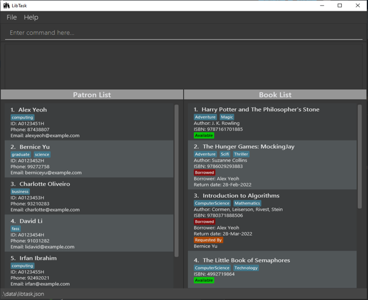

1. You can refer to [LibTask GUI Overview](#22-libtask-gui-overview) to understand what each component in the GUI does.

### 2.2. LibTask GUI Overview
The various GUI components of LibTask are described in the picture below:

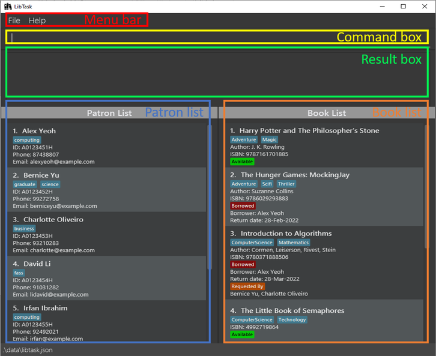

* `Menu bar`: Menu buttons that you can click to exit LibTask or to open up the help window that contains a link to this user guide.
* `Command box`: You can type and enter commands to run in this box.
* `Result box`: You can view the results from running your commands in this box.
* `Patron list`: You can view the list of patrons with their details in this list.
* `Book list`: You can view the list of books with their details in this list.

### 2.3. Tutorial

#### Step 1: Setting up your patron and book database

1. Remove existing sample data from LibTask's patron and book lists by entering the `clear` command in the Command Box.

**Warning:** 

Do not clear LibTask's pre-existing data if you wish to test its commands. You are recommended to finish testing prior 
to doing this tutorial.

2. Add some books into LibTask's book list using the `book add` command.

   Below are some sample commands you can try running. You may continue adding more books while
   ensuring that the format of your command follows [book add](#331-adding-a-book-book-add).

   **`book add n/Harry Potter i/97888-69183-157 a/J.K.Rowling t/Thriller t/Magic`**: Adds a book titled `Harry Potter` 
      into LibTask's book list.

   **`book add n/To Kill a Mockingbird i/97804-46310-789 a/Harper Lee t/Thriller t/Suspense`**: Adds a book title 
      `To Kill a Mockingbird` into LibTask's book list.

   **`book add n/The Da Vinci Code i/97803-85513-227 a/Dan Brown t/Thriller t/Mystery t/Crime`**: Adds a book titled 
     `The Da Vinci Code` into LibTask's book list.

   **`book add n/The Two Towers i/97800-07203-598 a/J. R. R. Tolkein t/Action t/Fantasy t/Adventure t/Drama`**: Adds a 
      book titled `The Two Towers` into LibTask's book list.

   **`book add n/Death on the Nile i/97800-06168-959 a/Agatha Christie t/Mystery t/Drama t/Crime t/Thriller`**: 
      Adds a book titled `Death on the Nile` into LibTask's book list.

3. Add some patrons into LibTask's patron list using the `patron add` command.

   Below are some sample commands you can try running. You may continue adding more patrons while
   ensuring that the format of your command follows [patron add](#321-adding-a-patron-patron-add).

   **`patron add n/Alice s/A0123456H p/90123212 e/profA@u.nus.edu t/professor`**: Adds a patron named `Alice` into 
      LibTask's patron list.

   **`patron add n/Bob Miller s/A4468931X p/92940284 e/bobmiller@u.nus.edu t/student`**: Adds a patron named 
     `Bob Miller` into LibTask's patron list.

   **`patron add n/Harper Lee s/A0988773M p/91437496 e/harperlee@u.nus.edu`**: Adds a patron named `Harper Lee` into 
      LibTask's patron list.

   **`patron add n/Jessica s/A6666789G p/90194628 e/jessica@u.nus.edu t/student`**: Adds a patron named `Jessica` into 
      LibTask's patron list.

   **`patron add n/Christian Grey s/A0123345L p/91214567 e/christian@u.nus.edu`**: Adds a patron named `Christian Grey` 
      into LibTask's patron list.

#### Step 2: Borrow some books

Harper Lee wishes to borrow Death on the Nile. You may create a book loan for her in one of the two following ways:

Method A:
1. Scroll through the patron list to find the index at which `Harper Lee` is stored in LibTask. Let's say this index 
   number is 3.
2. Scroll through the book list to find the index at which `Death on the Nile` is stored in LibTask. Let's say this 
   index number is 5.
3. Enter command `borrow 3 5 25-Apr-2022` in the Command box. `Harper Lee` has now borrowed `Death on the Nile` with a 
   return date of 25th April 2022. You can confirm this by viewing the book's status in the book list.  

Method B:
1. Enter `patron find harper lee` in the Command box. Running this command will display `Harper Lee` first in the patron
   list. Learn more about the format of the `patron find` command [here](#324-finding-patrons-patron-find).
2. Enter `book find n/death on the nile` in the Command box. Running this command will display `Death on the Nile` first
   in the book list. Learn more about the format of the `book find` command [here](#333-finding-books--book-find).
3. Enter command `borrow 1 1 25-Apr-2022` in the Command box. `Harper Lee` has now borrowed `Death on the Nile` with a 
   return date of 25th April 2022. You can confirm this by viewing the book's status in the book list.

**Notes:** 

* The return dates of the above `borrow` commands may be changed. 

* Learn more about the `borrow` command [here](#336-borrowing-a-book--borrow).

#### Step 3: Creating book requests

Christian Grey wishes to borrow Death on the Nile however, the book seems to be borrowed by Harper Lee when the command 
`book find n/death on the nile` is run. In this case and similar scenarios, you can create a book request in one of the 
two following ways:

Method A:
1. Scroll through the patron list to find the index at which `Christian Grey` is stored in LibTask. Let's say this index
   number is 5.
2. Scroll through the book list to find the index at which `Death on the Nile` is stored in LibTask. Let's say this
   index number is 5.
3. Enter command `request 5 5` in the Command Box. `Christian Grey` has now requested for `Death on the Nile`. You can 
   confirm this by viewing the book's status in the book list.

Method B:
1. Enter `patron find christian grey` in the Command box. Running this command will display `Christian Grey` first in 
   the patron list. Learn more about the format of the `patron find` command [here](#324-finding-patrons-patron-find).
2. Enter `book find n/death on the nile` in the Command box. Running this command will display `Death on the Nile` first
   in the book list. Learn more about the format of the `book find` command [here](#333-finding-books--book-find).
3. Enter command `request 1 1` in the Command box. `Christian Grey` has now requested for `Death on the Nile`. You can
   confirm this by viewing the book's status in the book list.

Subsequently, when Harper Lee returns Death on the Nile, find the book by entering `book find n/death on the nile` 
(which would result in it being displayed first) followed by `return b/1` (more about the `return` command 
[here](#337-returning-a-book--return)). `Death on the Nile` is hence returned and the Result box would prompt you to 
notify Christian Grey that the book is now available. 

**Notes:** 

* Multiple patrons may request for `Death on the Nile` in which case, Result box would prompt you to notify all of them 
  once the book is returned.

* Learn more about the `request` command [here](#338-requesting-a-book--book-request).

--------------------------------------------------------------------------------------------------------------------

## **3. Features**

This section describes the features supported by LibTask and how to use them.

**:information_source: Notes about the command format:** 

* Words in `UPPER_CASE` are the parameters to be supplied by the user. 
  e.g. in `patron delete INDEX`, `INDEX` is a parameter which the user can enter and can be used as `patron delete 1`.

* Items in square brackets are optional. 
  e.g. `patron add n/NAME s/ID p/PHONE e/EMAIL [t/TAG]…​ ` can be used as `patron add n/John s/A0123456A p/93231222 e/e03482@u.nus.edu t/student` or as `patron add n/John s/A0123456A p/93231222 e/e03482@u.nus.edu`.

* Items with `…`​ after them can be used multiple times including zero times. 
  e.g. `[t/TAG]…​` can be used as ` ` (i.e. 0 times), `t/friend` or `t/friend t/family` etc.

* Parameters can be in any order. 
  e.g. if the command specifies `n/NAME p/PHONE_NUMBER`, `p/PHONE_NUMBER n/NAME` is also acceptable.

* If a parameter is expected only once in the command but you specified it multiple times, only the last occurrence of the parameter will be taken. 
  e.g. if you specify `p/12341234 p/56785678`, only `p/56785678` will be taken.

* Extraneous parameters for commands that do not take in parameters (such as `help`, `patron list`, `book list`, `exit` and `clear`) will be ignored. 
  e.g. `help 123` will be interpreted as `help`.

### 3.1. General Features

This section describes features users can use to navigate through LibTask.

--------------------------------------------------------------------------------------------------------------------

#### 3.1.1. Viewing help : `help`

Opens a help window explaining how to access LibTask's user guide.

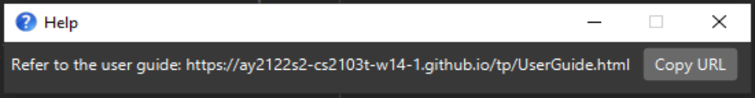

Format: `help`

#### 3.1.2. Clearing all entries : `clear`

Clears all patrons and books from LibTask's patron and book lists.

Format: `clear`

#### 3.1.3. Exiting LibTask : `exit`

Exits the program.

Format: `exit`

#### 3.1.4. Retrieving previous command: `u`

Retrieves the previous command entered by the user back to the command box.

Format: `u`

* Loads your previous successfully entered commands back to the command box so you can view and rerun it.
* Only allows each command to be viewed once.

#### Saving LibTask's data

LibTask's data is saved in the hard disk automatically after any command that changes it. There is no need to save manually.

### 3.2. Patron Features

This section describes features users can use to interact with LibTask's patron list.

--------------------------------------------------------------------------------------------------------------------
#### 3.2.1. Adding a patron: `patron add`
Adds a patron to LibTask's patron list.

Format: `patron add n/NAME s/ID p/PHONE e/EMAIL [t/TAG]…​`

**Notes about the add command:** 

* ID must be 9 characters in length. First character of ID should be 'A' and last character of ID should be an alphabet.

* NAME can be a maximum of 40 characters.

* EMAIL can be a maximum of 50 characters.

* You cannot add a patron with the same NAME, EMAIL or ID as another existing patron in the patron list.

**Example**

To add a patron with the name `John`, id `A0212828X`, phone number `93231222`, email `e03482@u.nus.edu` and tag `student`,
you can enter the following command:

`patron add n/John s/A0212828X p/93231222 e/e03482@u.nus.edu t/student`

Before entering the command, there is no existing patron with the same name, id or email in LibTask.

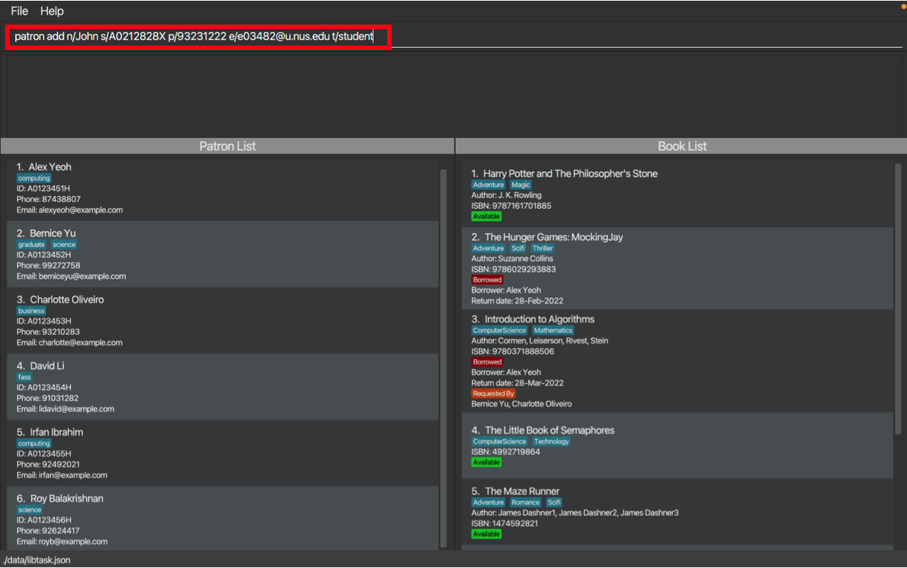

After entering the command, the new patron is added.

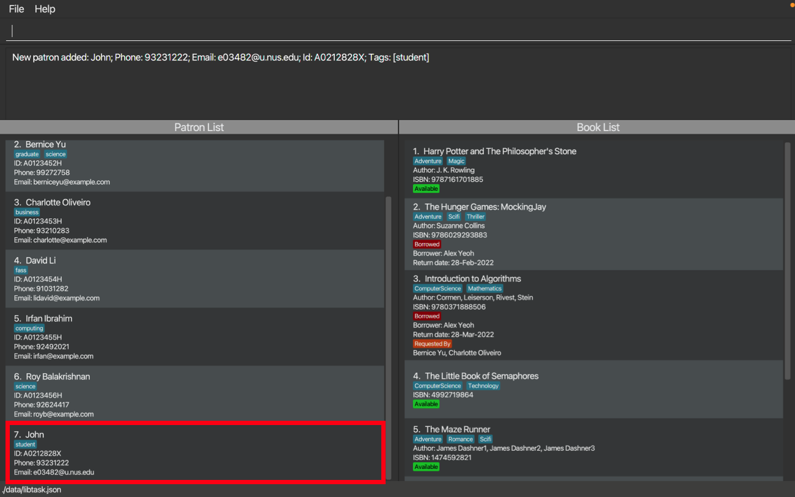

#### 3.2.2. Listing all patrons : `patron list`

To show a list of all patrons in LibTask, you can enter the list command with the format shown below.

Format: `patron list`

**Notes about the list command:** 

* If all patrons are already listed, the command will still show a success message as having listed all patrons, but the patrons listed will have no visual change.

**Example:** `patron list`

Before entering the command only two patrons are listed.

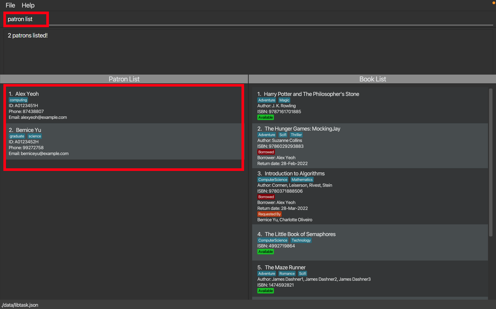

After entering the command, all patrons will be listed.

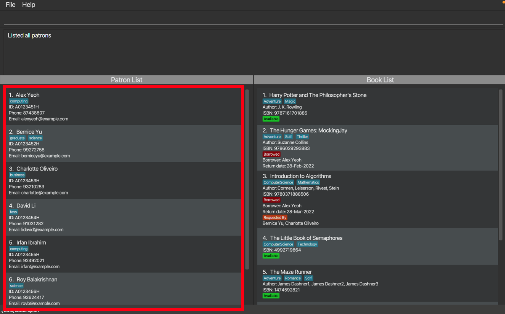

#### 3.2.4. Finding patrons: `patron find`

To find patrons in LibTask based on patron name, you can enter the find command with the format shown below.

Format: `patron find KEYWORD [KEYWORD]…​`

**Notes about the find command:** 

* The search is case-insensitive. e.g. `hans` will match `Hans`

* The order of the keywords does not matter. e.g. results from the keyword `Hans Bo` will match results of the keyword `Bo Hans`

* Only the name is searched.

* Only full words will be matched e.g. results from the keyword `Han` will not match results from the keyword `Hans`

* Patrons matching at least one part of the keyword will be returned (i.e. `OR` search).
  e.g. keyword `Hans Bo` will return patrons with names `Hans Gruber`, `Bo Yang`

**Example:**

To find all patrons with names containing the keywords "alex" or "david", you can enter the following command:

`patron find alex david`

Before entering the command, all patrons are displayed.

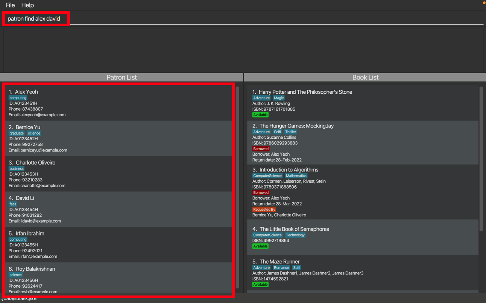

After entering the command, only patrons with names containing "alex" or "david" are displayed.

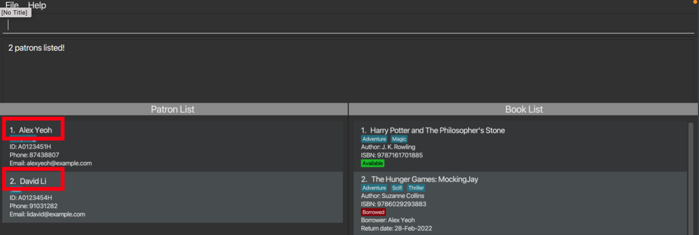

#### 3.2.3. Editing a patron : `patron edit`

To edit the details of a specific patron, you can enter the edit command with the format shown below.

Format: `patron edit INDEX [n/NAME] [s/ID] [p/PHONE] [e/EMAIL] [t/TAG]…​`

**Notes about the edit command:** 

* Edits the patron at the specified `INDEX`. The index refers to the index number shown in the displayed patron list. The index **must be a positive integer** 1, 2, 3, … and cannot exceed the largest index number in the displayed patron list.​

* At least one of the optional fields must be provided.

* Existing values will be updated to the input values.

* When editing tags, the existing tags of the patron will be removed i.e. adding of tags is not cumulative.

* You can remove all the patron’s tags by typing `t/` without specifying any tags after it.

* You cannot edit a patron's name, email or id to that of some other patron in LibTask.

**Examples:**

To edit the first patron's name from `Alex Yeoh` to `John Cena`, its phone number from `87438807` to `91959491` and email from `alexyeoh@example.com` to `johncena@u.nus.edu`, you can enter the following command:

`patron edit 1 n/John Cena p/91959491 e/johncena@u.nus.edu`

Before entering the command, the first patron still has its original name, phone number and email.

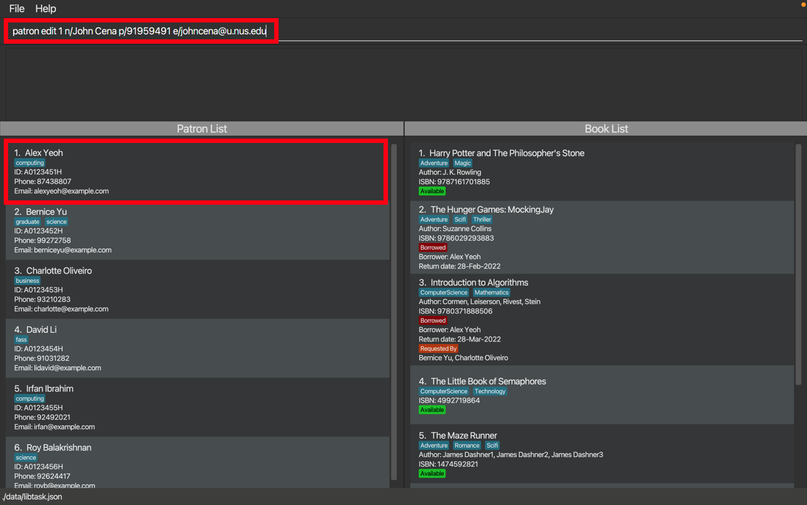

After entering the command, the first patron has its name edited to `John Cena`, phone number edited to `91959491` and email edited to `johncena@u.nus.edu`

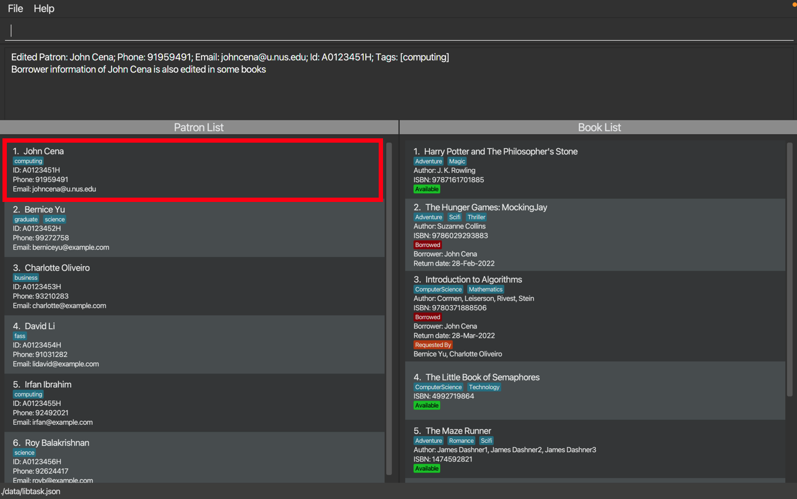

To remove all tags and edit the first patron's name from `Alex Yeoh` to `John Cena`, its phone number from `87438807` to `91959491` and email from `alexyeoh@example.com` to `johncena@u.nus.edu`you can enter the following command:

`patron edit 1 n/John Cena p/91959491 e/johncena@u.nus.edu t/`

Before entering the command, the first patron has different tags.

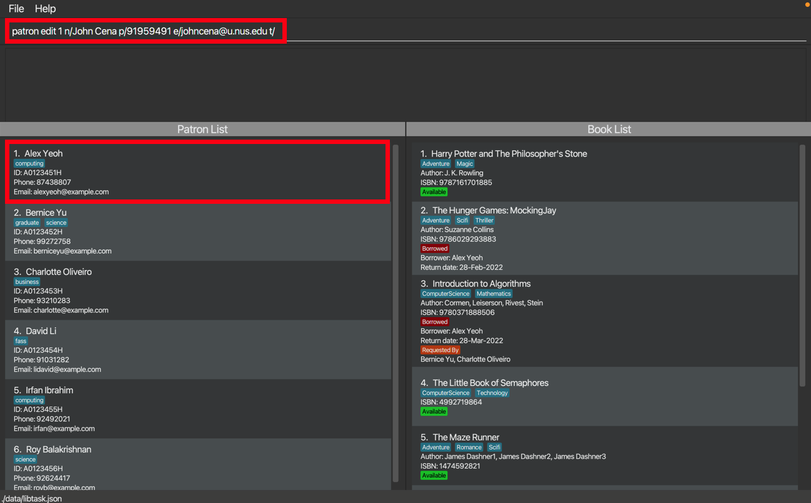

After entering the command, the first patron will have their tags removed.

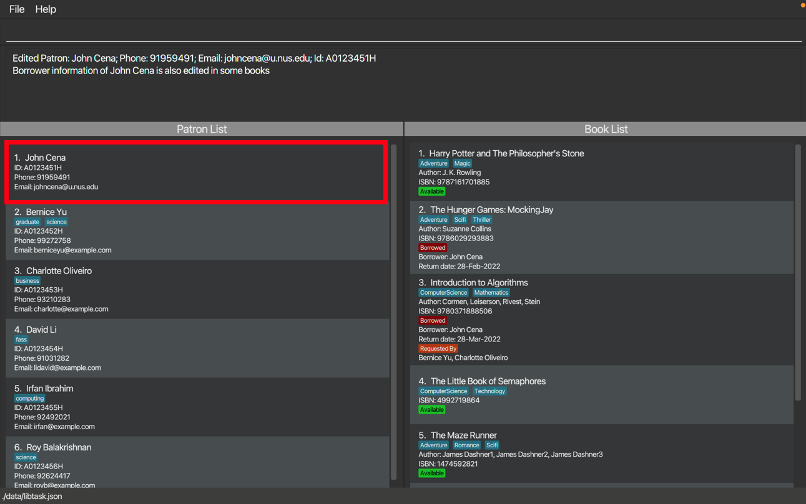

#### 3.2.5. Deleting a patron : `patron delete`

To delete a specific patron, you can enter the delete command with the format shown below.

Format: `patron delete INDEX`

**Notes about the delete command:** 

* Deletes the patron at the specified `INDEX`.

* The index refers to the index number shown in the displayed patron list.

* The index **must be a positive integer** 1, 2, 3, … and cannot exceed the largest index number in the displayed patron list.​

**Example:**

To delete the second patron, you can enter the following command:

`patron delete 2`

Before entering the command, the second patron in LibTask is `Bernice Yu`.

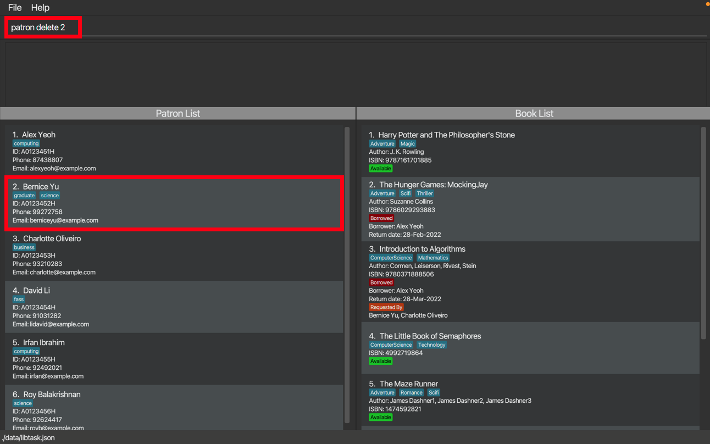

After entering the command, patron `Bernice Yu` is deleted.

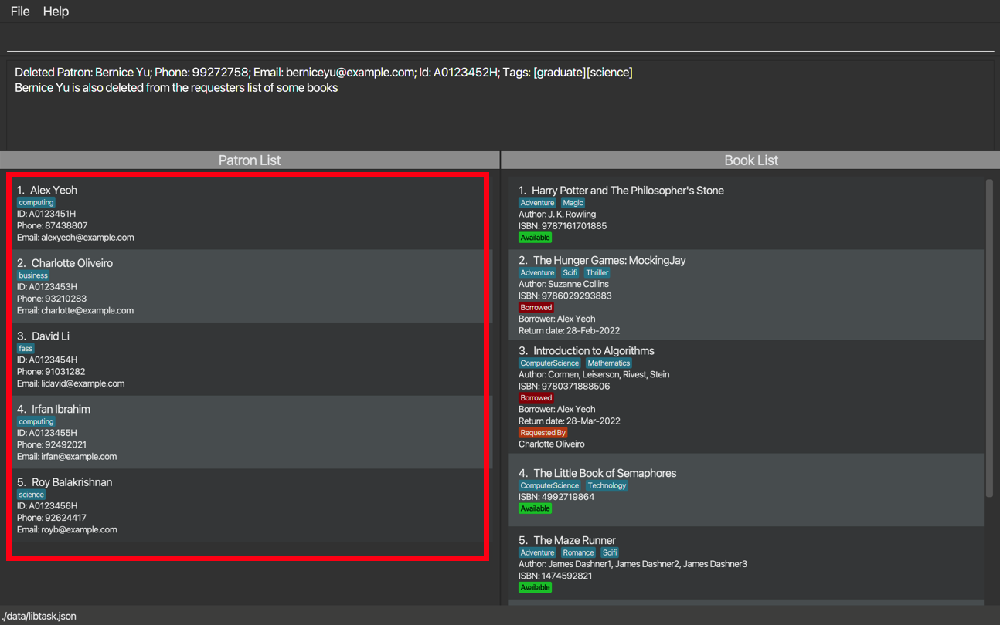

#### 3.2.6. Listing all patrons with overdue books : `patron overdue`

To list all patrons with overdue books, you can enter the overdue command with the format shown below.

Format: `patron overdue`

**Example:**

Before entering the command, all patrons are displayed.

After entering the command, only patrons with overdue books are displayed.

### 3.3. Book Features

This section describes features users can use to interact with LibTask's book list.

--------------------------------------------------------------------------------------------------------------------

#### 3.3.1. Adding a book: `book add`
Adds a book to LibTask's book list.

Format: `book add n/BOOK_NAME i/ISBN [a/AUTHOR] … [t/TAG] … `

**Notes about the add command:** 

* BOOK_NAME must start and end with alphanumeric characters, and can only contain `'` character, `:` character and alphanumeric characters.

* ISBN must be 10 or 13 digits in length, and contain only numbers with at most one `-` character between consecutive numbers. If it is 13 digits long, it must start with 978 or 979.

* ISBN digits must have valid checksum. Details on calculating checksum can be found in [this section](#6-appendix).

* AUTHOR must start with an alphanumeric character, and can only contain alphanumeric characters and `.` character.

* You can add multiple copies the same book with the same isbn. However, all books with the same isbn must also have the same name and written by the same authors.

* If books with the same isbn already exists, and is requested by some patrons, adding this book will also remove all requests for those books, and you will be reminded to notify patrons who are interested in this available book.

**Example**

To add a book with the name `Introduction to Algorithms`, isbn `9780371888506`, authors `Cormen`, `Leiserson`, `Rivest` and `Stein`, with a tag of `ComputerScience`, you can enter the following command:

`book add n/Introduction to Algorithms a/Cormen a/Leiserson a/Rivest a/Stein i/9780371888506 t/ComputerScience`

Before entering the command, a book with the same name already exists in LibTask. However, that copy is currently borrowed by Alex and requested by Bernice and Charlotte.
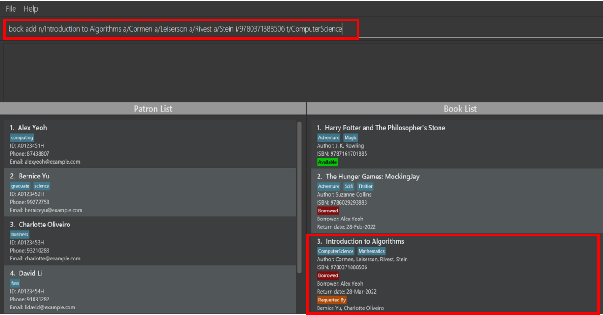

After entering the command, a new available copy of the book is added. You will also be reminded to notify Bernice and Charlotte about the availability of this book.
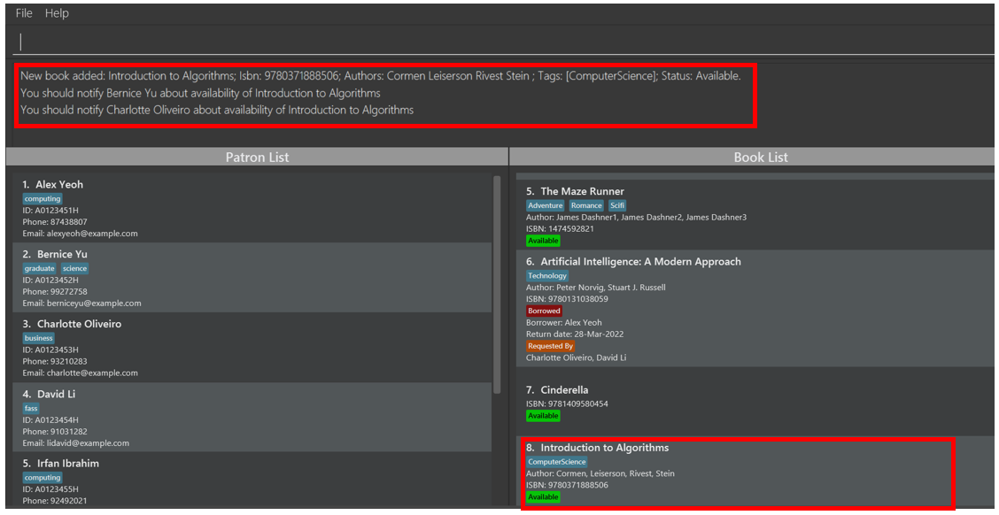

#### 3.3.2. Listing all books : `book list`

To show a list of all books in LibTask, you can enter the list command with the format shown below.

**Format**: `book list`

**Notes about the list command:** 

* If all books are already listed, the command will still show a success message as having listed all books, but the books listed will have no visual change.

**Example**: `book list`

Before entering the command, only two books are listed.
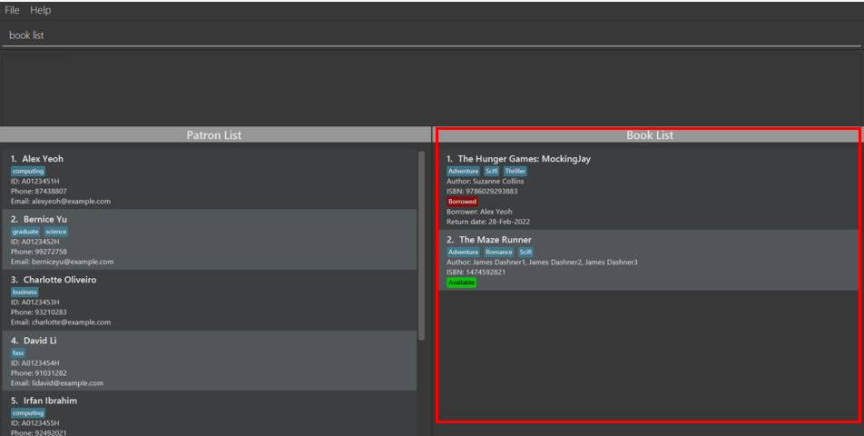

After entering the command, all books will be listed.
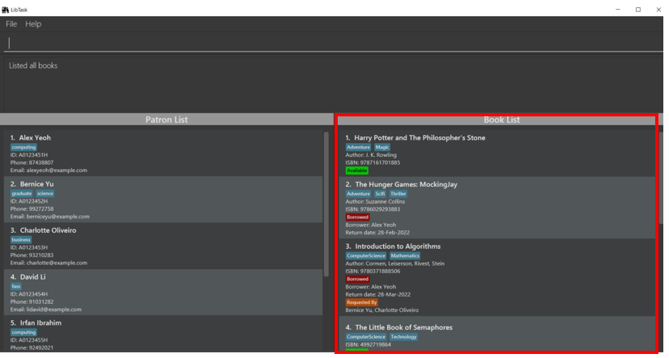

#### 3.3.3. Finding books : `book find`

To find books in LibTask based on book name, author or tags, you can enter the find command with the format shown below.

**Format**: `book find PREFIX/KEYWORD`

**Notes about the find command:** 

* `PREFIX` must be either `t` (for find based on tag), `a` (for finding based on author), or `n` (for finding based on book name).

* All books with a tag, or author, or book name that contains the substring `KEYWORD` will be displayed in the book list.

**Example**:

To find all books for computer science students, you can enter the following command:

`book find t/computer`

Before entering the command, all books are displayed.

After entering the command, only books that have a tag containing the keyword "computer" are displayed.
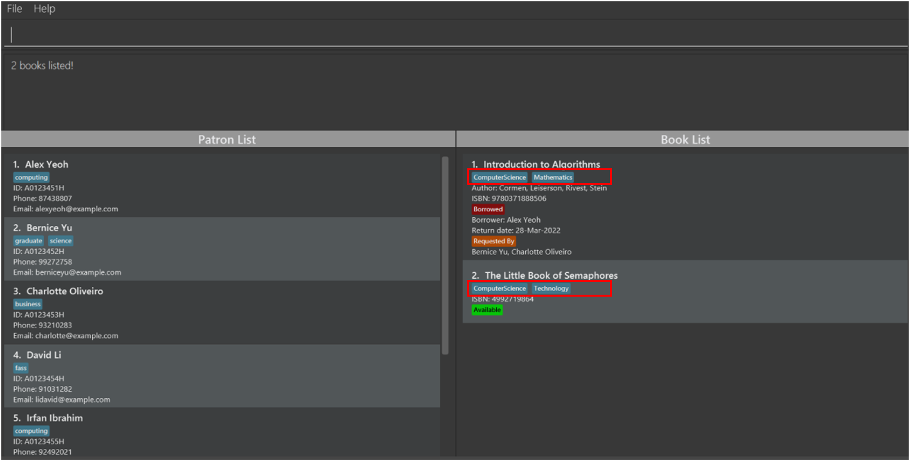

To find all books for with a book name containing the keyword `Harry`, you can enter the following command:

`book find n/Harry`

Before entering the command, all books are displayed.
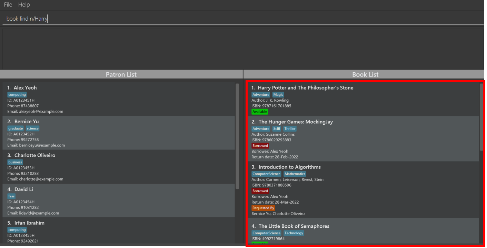

After entering the command, only one book which name contains `Harry` is displayed.
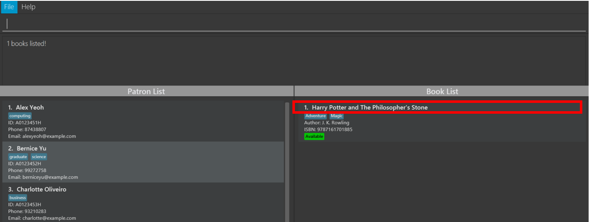

#### 3.3.4. Editing a book : `book edit`

To edit the details of a specific book, you can enter the edit command with the format shown below.

**Format**: `book edit INDEX [n/NAME] [i/ISBN] [a/AUTHOR] … [t/CATEGORY_TAG] …`

**Notes about the edit command:** 

* Edits the book at the specified `INDEX`. `INDEX` refers to the index number shown in the displayed book list. The index **must be a positive integer** 1, 2, 3, … and cannot exceed the largest index number in the displayed book list.

* At least one of the optional fields (ISBN, AUTHOR, CATEGORY_TAG) must be provided.

* Existing values will be updated to the input values.

* When a book's name, authors or isbn is changed, all copies of books with the same isbn will have their respective fields edited as well. This is because all books with the same isbn should have the same name and authors.

* When editing tags or authors, the existing tags or authors of the book will be removed i.e. adding of tags and authors is not cumulative. However, if all tags are added in a single input, the multiple tags will be added.

* You can remove all the book’s authors and tags by typing `a/` or `t/` respectively without specifying any tags after it.

* You cannot edit a book's isbn into a new isbn if the new isbn already belongs to another book in LibTask.

**Examples**:

To edit the first book's name from `Harry Potter: Sorcerer's Stone` to `Harry Potter 1`, and its tag to `Thriller` and `Magic`, you can enter the following command:

`book edit 1 n/Harry Potter 1 t/Thriller t/Magic`

Before entering the command, the first book still has its original name and tags.
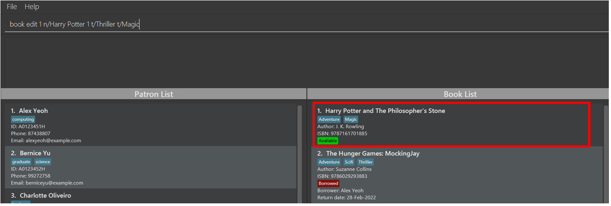

After entering the command, the first book has its name edited to `Harry Potter 1` and has tags `Thriller` and `Magic`
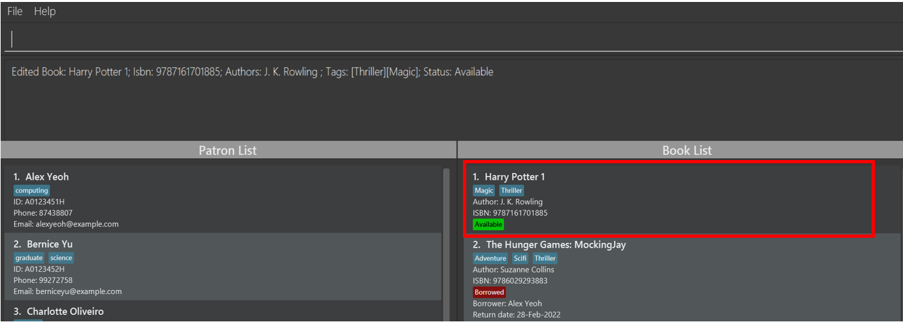

To remove all authors from and tags from the first book, you can enter the following command:

`book edit 1 a/ t/`

Before entering the command, there are two copies of `Harry Potter and The Philosopher's Stone`, both have different tags but has the same author `J. K. Rowling`.
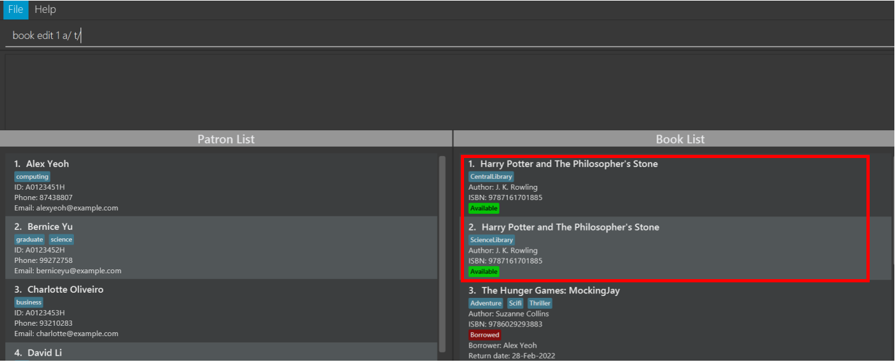

After entering the command, both copies will have their author removed. However, only the copy at the first index will have its tag removed, because different book copies can have different tags.
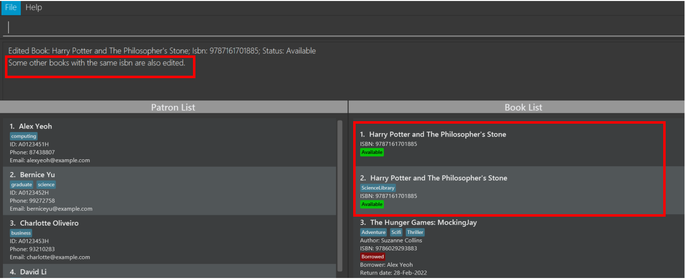

#### 3.3.5. Deleting a book : `book delete`

To delete a specific book, you can enter the delete command with the format shown below.

**Format**: `book delete INDEX`

**Notes about the delete command:** 

* Deletes the book at the specified `INDEX`. `INDEX` refers to the index number shown in the displayed book list. The index **must be a positive integer** 1, 2, 3, … and cannot exceed the largest index number in the displayed book list.

* You cannot delete a book that is borrowed. If you insist on deleting the book, you can first return the book.

**Example**:
* To delete the first book, you can enter the following command:

`book delete 1`

Before entering the command, there is a copy of `Harry Potter and The Philosopher's Stone` as the first book.
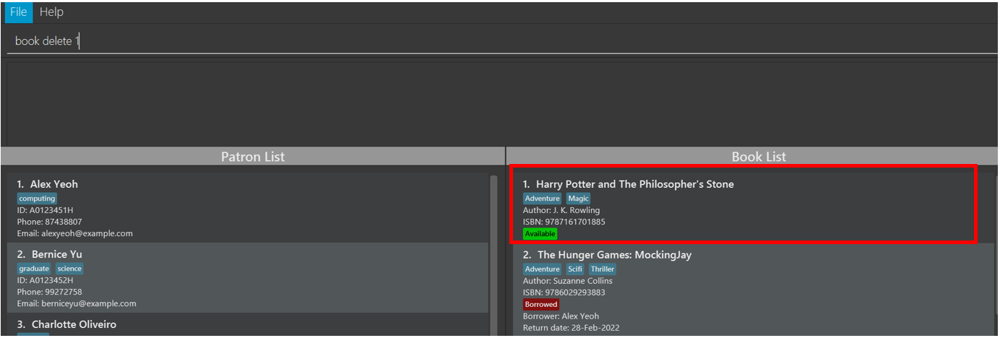

After entering the command, that copy of `Harry Potter and The Philospher's Stone` is deleted.
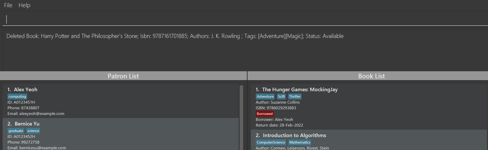

#### 3.3.6. Borrowing a book : `borrow`

To keep track that a specific patron is borrowing a specific book, you can enter the borrow command with the format shown below.

**Format**: `borrow PATRON_INDEX BOOK_INDEX RETURN_DATE`

**Notes about the borrow command:** 

* `PATRON_INDEX` refers to the index number of a patron shown in the displayed patron list.

* `BOOK_INDEX` refers to the index number of a book shown in the displayed book list.

* Both `PATRON_INDEX` and `BOOK_INDEX` **must be a positive integer** 1, 2, 3, …

* Both `PATRON_INDEX` and `BOOK_INDEX` cannot exceed the largest index number in the displayed patron list or book list, respectively.

* `RETURN_DATE` must be in dd-MMM-yyyy format (e.g. 20-May-2022) and must be later than the current date.

* A patron cannot borrow multiple copies of the same book with the same isbn.

* A patron cannot borrow a book that is already borrowed by someone else.

**Example**:
* To keep track that the first patron is borrowing the first book until a return date of 5th May 2022, you can enter the following command:

`borrow 1 1 05-May-2022`

Before entering the command, the first book is available.
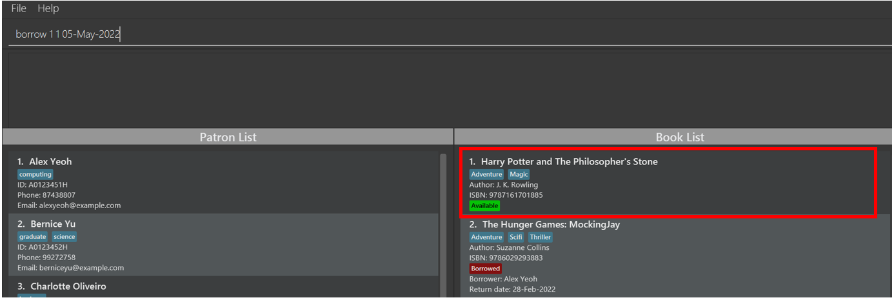

After entering the command, that first book is labelled as borrowed, and is borrowed by the first patron Alex Yeoh, until a return data of 05-May-2022.
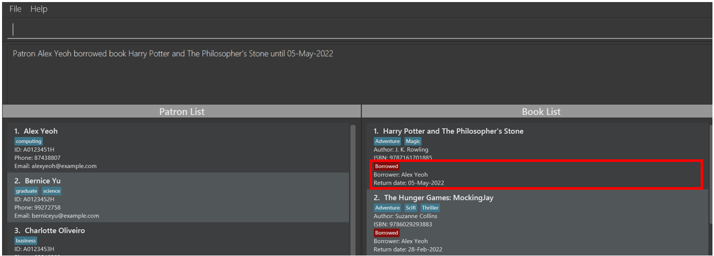

#### 3.3.7. Returning a book : `return`

To return a specific book, or to return all books by a specific patron, you can enter the return command with the format shown below.

**Format**: `return PREFIX/INDEX`

**Notes about the return command:** 

* `PREFIX` must be either `p` for patrons or `b` for books.

* If `PREFIX` is `p`, `INDEX` refers to the index number of the patron who is returning books, as shown in the displayed patron list.

* If `PREFIX` is `b`, `INDEX` refers to the index number of the book to be returned, as shown in the displayed book list.

* `INDEX` **must be a positive integer** 1, 2, 3, … and cannot exceed the largest index number in the displayed book list (if prefix is `b`) or patron list (if prefix is `p`).

* If the book at index `INDEX` is not borrowed, or if the patron at index `INDEX` does not borrow any books, a message is shown.

* If there are patrons who requested to be notified about the availability of the returned books, you will be reminded to notify them. Subsequently, all requests for those books will be deleted automatically.

* You cannot return a specific book if it is not borrowed

* You cannot return all books by a patron if the patron did not borrow any books.

**Examples**:
* To return all books borrowed by the first patron, you can enter the following command:

`return p/1`

Before entering the command, there are three books borrowed by the first patron. There are also two patrons requesting to be notified when the third book becomes available.
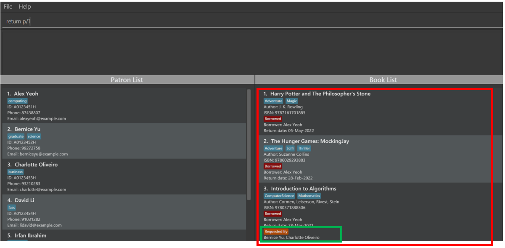

After entering the command, all three books borrowed by the first patron is returned. Furthermore, you are reminded to notify the two patrons who requested for the third book.
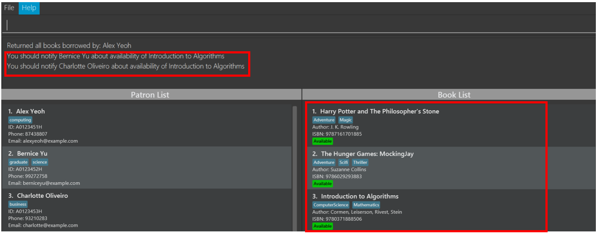

* To return only the third book, you can enter the following command:

`return b/3`

Before entering the command, the third book is labelled as borrowed, and has two requesters requesting to be notified when it becomes available.
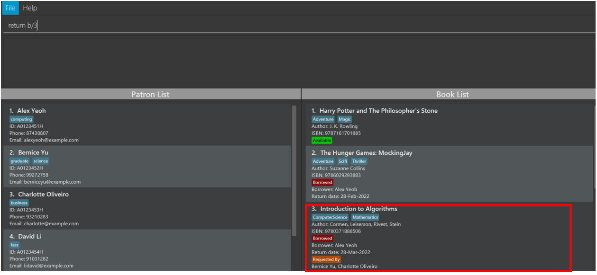

After entering the command, the third book becomes available. The two requesters are also removed as you are reminded to notify both of them about the availability of the returned book.
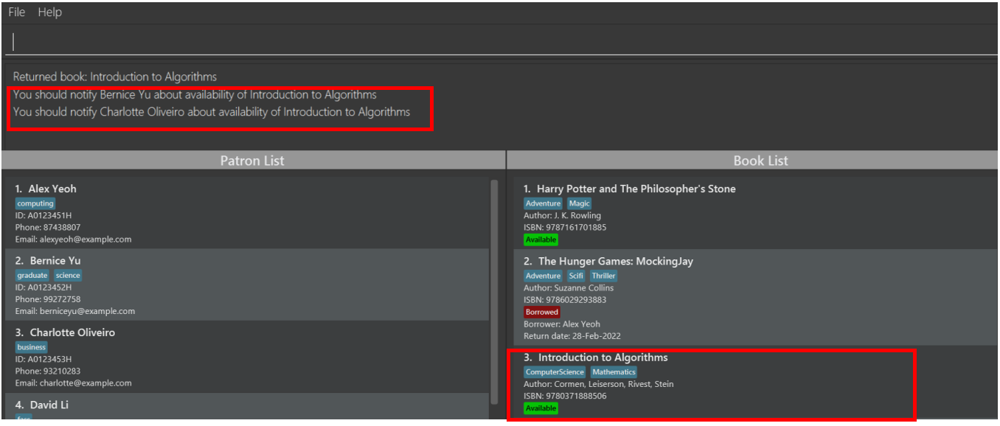

#### 3.3.8. Requesting a book : `book request`

To keep track that a specific patron is requesting for a specific book, you can enter the request command with the format shown below.

**Format**: `book request PATRON_INDEX BOOK_INDEX`

**Notes about the request command:** 

* `PATRON_INDEX` refers to the index number of the patron who is requesting for the book, as shown in the displayed patron list.

* `BOOK_INDEX` refers to the index number of the book to be requested, as shown in the displayed book list.

* Both `PATRON_INDEX` and `BOOK_INDEX` **must be a positive integer** 1, 2, 3, …

* Both `PATRON_INDEX` and `BOOK_INDEX` cannot exceed the largest index number in the displayed patron list or book list, respectively.

* Book requests are associated with books with the same isbn, not a book copy. For example, when patron Alex requests for the first book, LibTask recognizes that Alex is requesting for books with the same isbn as the first book.

* A patron can only request for a book if all copies of the book is borrowed. This is because if there is an available copy of the book, you can let the patron borrow that copy without requesting for it.

* A patron cannot request for the same book again if LibTask is still keeping track of his previous request.

* A patron cannot request for a book if he/she is currently borrowing a copy of that book.

* A book can have a maximum number of book requests equal to the number of books with the same isbn in LibTask. There is no need to have too many book requests because ultimately each copy of the book can only be borrowed by one patron.

**Example**:
* To keep track that the second patron is requesting for first book, you can enter the following command:

`book request 2 1`

Before entering the command, there are two books with the same isbn as the first book. Both copies of the book are already borrowed.
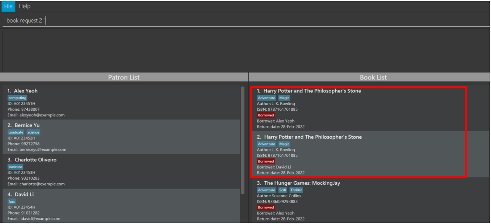

After entering the command, both books are labelled as requested by Bernice Yu (the name of the second patron).
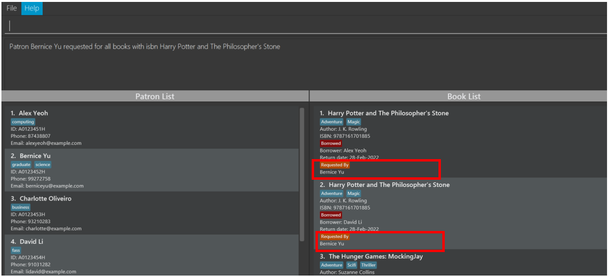

When a copy of this book becomes available later, you will be reminded to notify Bernice Yu automatically.

#### 3.3.9. Listing all books related to a patron : `book related`

To list all books borrowed by or requested by a specific patron, you can enter the related command with the format shown below.

**Format**: `book related INDEX`

**Notes about the related command:** 

* Lists all books borrowed by or requested by a patron at `INDEX`. `INDEX` refers to the index number of the patron of interest, as shown in the displayed patron list.

* If the patron of interest did not borrow any book or request for any book, an empty book list will be shown.

**Example**:
* To list all books borrowed by or requested by the second patron, you can enter the following command:

`book related 2`

Before entering the command, the book list displays all books in LibTask.
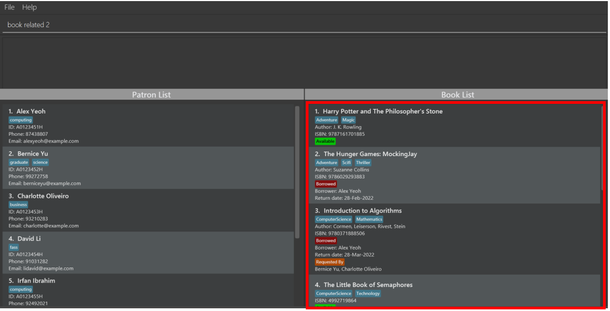

After entering the command, the book list displays only books that are borrowed by or requested by Bernice Yu (the second patron). In this case, only one book is shown because Bernice Yu did not borrow any book, and requested for one book.
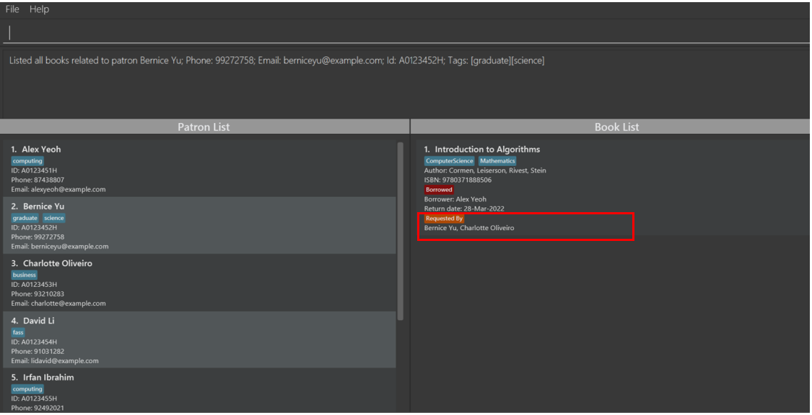

This command is typically used after `patron overdue` command. After listing all patrons with overdue books, you can use this command to check which books are overdue by each patron.

#### Editing the data file

LibTask's data is saved as a JSON file `[JAR file location]/data/libtask.json`. Advanced users are welcome to update data directly by editing that data file.

:exclamation:
**Caution:**
If your changes to the data file makes its format invalid, LibTask will discard all data and start with an empty data file at the next run.

## **4. FAQ**

**Q1**: What happens if there is no response after attempting to enter a command? 
**A**: Please double-check if the format of the command is written correctly. If the issue persists, please close the
application and restart it again.

**Q2**: I tried to edit a book's details, but there seems to be an error message being shown. Why is that so? 
**A**: Please do ensure that if the book name is not provided, at least one of the optional fields Isbn, Author and
Category tag is provided.

**Q3**: Is there any other way to exit the application without typing? 
**A**: Yes, there is another way to exit the program, and that is by clicking the File button on the top left-hand
corner of the app. There is an exit button in the dropdown list which appear after clicking the File button.

**Q4**: Will the data of the books be saved if the program was not closed via the `exit` command or via the
method shown in Q3? 
**A**: Yes the data will still be saved. However, to ensure a better user experience, we recommend using the exit
command as described in the user guide.

**Q5**: Is there a shortcut on using the various commands? 
**A**: Unfortunately, no there is no shortcut. In order to execute the various commands, please enter the commands
in the correct format and with valid inputs.

**Q6**: I entered the `book list` command but nothing has changed. Is this expected? 
**A**: Yes, it is expected, as all the books have probably been already listed.

**Q7**: Is there a summary of the commands? 
**A**: Yes, there is a summary of commands available, and they can be found in the section below.

**Q8**: Why are there two separate lists for books and patrons instead of one combined list? 
**A**: This is done so that the user can see the two lists side by side and have a clearer picture of the various
patrons and books in the database.

**Q9**: Why are the "requested by" tags removed from the books after a patron has returned that particular book? 
**A**: Once a book has been returned and that book has been requested, a list of alerts will be shown to the librarian
to remind the patrons that have requested the book. The purpose of the automatic deletion of the "requested by" tag is
a feature that is meant to provide convenience for the user and make them more productive because they would not need
to manually input additional commands to delete the "requested by" tags.
--------------------------------------------------------------------------------------------------------------------

## **5. Command summary**

### 5.1. General Commands

| Function                                   | Format Of Command                                                          |
|--------------------------------------------|----------------------------------------------------------------------------|
| **Show message to help page**              | `help`                                                                     |
| **Clear all entries**                      | `clear`                                                                    |
| **Exit the program**                       | `exit`                                                                     |
| **Show previous commands**                 | `u`                                                                        |

### 5.2. Patron Commands

| Function                            | Format Of Command                                                 |
|-------------------------------------|-------------------------------------------------------------------|
| **Add a new patron**                | `patron add n/NAME s/ID p/PHONE e/EMAIL [t/TAG]…​`                |
| **List all patrons**                | `patron list`                                                     |
| **Edit a patron**                   | `patron edit INDEX [n/NAME] [s/ID] [p/PHONE] [e/EMAIL] [t/TAG]…​` |
| **Find a patron**                   | `patron find KEYWORD [KEYWORD]…​`                                 |
| **Delete a patron**                 | `patron delete INDEX`                                             |
| **List patrons with overdue books** | `patron overdue`                                                  |

### 5.3. Book Commands

| Function                               | Format Of Command                                                   |
|----------------------------------------|---------------------------------------------------------------------|
| **Add a book**                         | `book add n/NAME i/ISBN [a/AUTHOR]…​ [t/CATEGORY_TAG]…​`            |
| **List all books**                     | `book list`                                                         |
| **Find a book**                        | `book find [n/NAME] [t/TAG] [a/AUTHOR]`                             |
| **Edit a book**                        | `book edit INDEX [n/NAME] [i/ISBN] [a/AUTHOR]…​ [t/CATEGORY_TAG]…​` |
| **Delete a book**                      | `book delete INDEX`                                                 |
| **Borrow a book**                      | `borrow PATRON_INDEX BOOK_INDEX RETURN_DATE`                        |
| **Return a book**                      | `return PREFIX/INDEX`                                               |
| **Request a book**                     | `book request PATRON_INDEX BOOK_INDEX`                              |
| **List all books related to a patron** | `book related INDEX`                                                |

## **6. Appendix**

### 6.1. Calculating ISBN checksum

There are two types of ISBN, 10-digit ISBNs and 13-digit ISBNs. Both types of ISBN have different ways of calculating checksums, as illustrated below. For easy testing and exploration, you can generate valid ISBNs from [this website](http://sqa.fyicenter.com/1000332_Test_ISBN_Number_Generator.html) without having to perform the tedious calculations yourself to ensure its validity.

#### 10-digit ISBN checksum

* Step 1. For each of the 10 digits, from left to right, multiply the digit by an integer weight. The weights are descending from 10 to 1 from left to right.

* Step 2. After obtaining the product of digit and weight for each digit, sum all the products.

* Step 3. The 10-digit ISBN checksum is valid if the sum of products is a multiple of 11.

**Example:**

The checksum for an 10-digit ISBN of 0-306-40615-2 is calculated as follows:

`checksum = (0 × 10) + (3 × 9) + (0 × 8) + (6 × 7) + (4 × 6) + (0 × 5) + (6 × 4) + (1 × 3) + (5 × 2) + (2 × 1) = 132 `

Since 132 is a multiple of 11, the above 10-digit ISBN has a valid checksum.

#### 13-digit ISBN checksum

* Step 1. For each of the 13 digits, from left to right, multiply the digit by an integer weight. The weight is a number alternating between 1 and 3, from left to right.

* Step 2. After obtaining the product of digit and weight for each digit, sum all the products.

* Step 3. The 13-digit ISBN checksum is valid if the sum of products is a multiple of 10.

**Example:**

The checksum for an 13-digit ISBN of 978-0-306-40615-7 is calculated as follows:

`checksum = (9 × 1) + (7 × 3) + (8 × 1) + (0 × 3) + (3 × 1) + (0 × 3) + (6 × 1) + (4 × 3) + (0 × 1) + (6 × 3) + (1 × 1) + (5 × 3) + (7 × 1) = 100`

Since 100 is a multiple of 10, the above 13-digit ISBN has a valid checksum.

## **7. Glossary**

| Term                                      | Explanation                                                                                     |
|-------------------------------------------|-------------------------------------------------------------------------------------------------|
| Command-line Interface (CLI)              | An interface which involves the users typing text and executing it as commands.                 |
| Graphical User Interface (GUI)            | An interface which involves the users clicking buttons and selecting options from the menu bar. |
| Java                                      | A programming language which was used to built LibTask.                                         |
| International Standard Book Number (ISBN) | An international standard identification number for identifying books.                          |
| Patron                                    | Visitor of the library.                                                                         |
